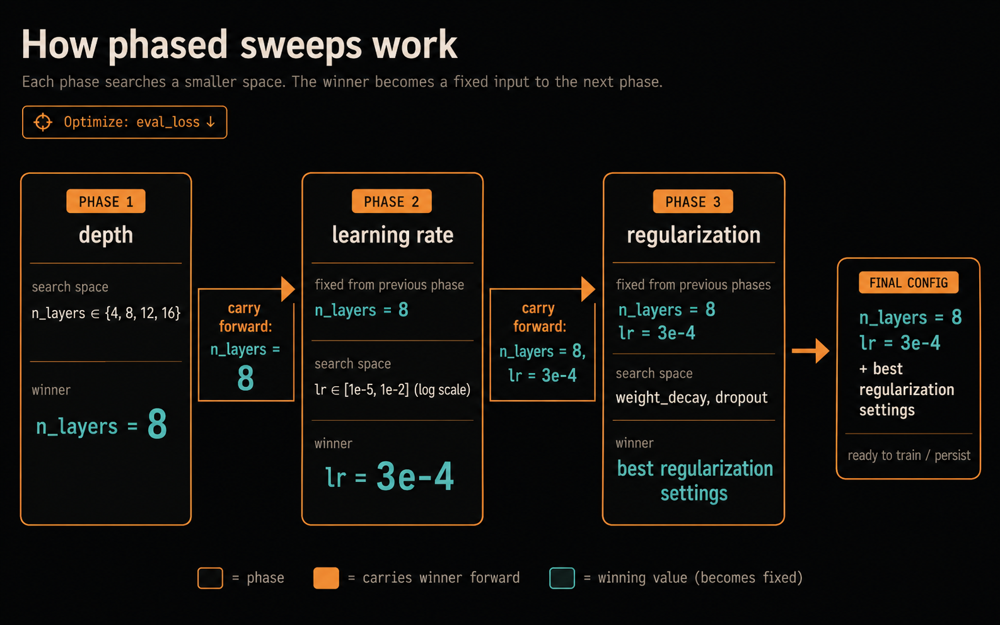

# phasesweep

> Orchestration layer for YAML-driven, phase-chained hyperparameter sweeps over your own training scripts

Your trainer runs the experiments. `phasesweep` decides what to try next. Define phased Optuna sweeps in YAML; a phase can inherit earlier winners as fixed overrides.

Use `phasesweep` when a full joint sweep is too expensive and the search can be broken into inspectable stages, such as architecture depth, then learning rate, then regularization. The [config guide](docs/config.md#phase-keys) explains the tradeoff and inheritance model.



## Requirements

- Python 3.10+; real runs need a [supported POSIX platform](docs/runtime.md#platform-support)
- The optional MCP server requires Linux for PID-reuse-safe cancellation and recovery
- A trainer command that follows the [trainer contract](docs/config.md#trainer-contract)
- GPU optional; see [GPU concurrency and isolation](docs/runtime.md#concurrency-model)

## Install

phasesweep is currently installed from Git:

```bash
python -m pip install "phasesweep @ git+https://github.com/pszemraj/phasesweep.git"
# weights-and-biases integration is optional:
python -m pip install "phasesweep[wandb] @ git+https://github.com/pszemraj/phasesweep.git"
# MCP server, to drive sweeps from an AI agent:
python -m pip install "phasesweep[mcp] @ git+https://github.com/pszemraj/phasesweep.git"
# all dev dependencies:
python -m pip install "phasesweep[dev,wandb] @ git+https://github.com/pszemraj/phasesweep.git"
```

For local development from a checkout:

```bash
git clone https://github.com/pszemraj/phasesweep.git
cd phasesweep
# activate venv of your choice, then:
python -m pip install -e ".[dev,wandb]"
```

## Quickstart

To run the bundled toy example from a checkout:

```bash
phasesweep validate examples/experiment.yaml
phasesweep run examples/experiment.yaml --dry-run
phasesweep run examples/experiment.yaml
phasesweep show-winners examples/experiment.yaml
phasesweep status examples/experiment.yaml
```

`validate` and `--dry-run` launch no trials; dry-run is an in-memory command-composition preview, not a check that the trainer or evidence pipeline works. See [validation and dry-run](docs/runtime.md#validation-and-dry-run) for the exact boundary. `show-winners` and `status` are read-only inspection commands, normally used after the real run.

The bundled example launches a deterministic fake trainer, runs 32 short trials, and writes outputs under `runs/`. For a real-trainer integration, see [examples/tiny_decoder_enwik8](examples/tiny_decoder_enwik8/README.md).

## MCP server (agent integration)

`phasesweep-mcp` lets an AI agent operate experiments you have already reviewed. You keep control of the config, trainer command, search space, and permissions in a catalog; the agent sees stable experiment ids and can validate, launch, monitor, cancel when allowed, and summarize winners without receiving paths, commands, raw logs, storage URLs, or workdirs.

Follow [MCP agent setup](docs/mcp_setup.md) to install the server, create and preflight a catalog, connect a supported client, and give the agent its operating instructions. See [MCP server](docs/mcp.md) for catalog fields, tool behavior, run state, and security boundaries.

## Docs

- [Config guide](docs/config.md): trainer contract, override formats, experiment YAML, suites, search spaces, gates, promotion, extractors.
- [Config reference](docs/config_reference.yaml): hand-written, non-runnable per-key contract with every type, default, valid value, constraint, interaction, and lifecycle warning.
- [Runtime behavior](docs/runtime.md): filesystem layout, locks, GPU leases, process cleanup, fingerprints, resume.
- [MCP server](docs/mcp.md): expose an experiment to an AI agent - catalog format, tools, security model, single-host operation.
- [MCP agent setup](docs/mcp_setup.md): five steps from install to a working agent - install the `[mcp]` extra, write and preflight a catalog, connect your clients with `phasesweep mcp install`, verify, instruct the agent.
- [MCP agent workflow](src/phasesweep/mcp/agent_prompt.md): Markdown instructions shipped to supported coding clients.
- [Tiny Decoder Enwik8 example](examples/tiny_decoder_enwik8/README.md): real-trainer `json_file` integration with a pinned submodule.
- [Development](docs/development.md): test commands and test-suite map.

## License

MIT. See [LICENSE](LICENSE).
