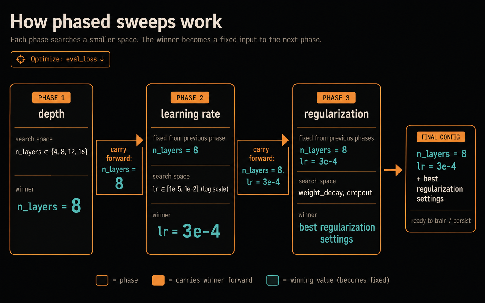

# PhaseSweep

PhaseSweep runs phase-chained hyperparameter sweeps from one ordinary YAML file. That file contains your trainer's base configuration, the metric, and the search plan. PhaseSweep materializes a complete trainer YAML for every trial, decides what to try next, persists each phase winner, and carries selected values forward as fixed inputs to later phases.

This is useful when a full joint sweep is too expensive or hard to interpret. For example, choose architecture depth, then tune learning rate, then regularization. The [configuration guide](docs/config.md#phase-keys) explains the inheritance model and its tradeoffs.



## How it works

One YAML file defines an experiment: a trainer command, a metric to optimize, and an ordered list of phases. Each phase sweeps its own small search space, and a phase that `inherits` an earlier one receives that phase's winning parameters as fixed inputs. Abridged from the starter that `phasesweep init` generates (the full file also pins storage, the working directory, and the metric extractor):

```yaml
experiment: phasesweep_starter

# The trainer receives one complete generated YAML per trial.
trial_command: "python -m phasesweep.examples.fake_train --config {config_path}"

trainer_config:
  model:
    n_layers: 8
    dropout: 0.1
  optimizer:
    lr: 0.0003
    weight_decay: 0.05

metric:
  name: eval_loss
  goal: minimize

phases:
  - name: depth
    n_trials: 2
    sampler: { type: grid }
    search_space:
      model.n_layers: { type: categorical, choices: [6, 8] }

  - name: learning_rate
    inherits: [depth] # the winning model.n_layers is fixed here
    n_trials: 2
    sampler: { type: grid }
    search_space:
      optimizer.lr: { type: categorical, choices: [0.0001, 0.0003] }
```

The packaged fake trainer reads the generated YAML and reports its objective through `report_objective(...)`. W&B is an optional evidence source, not a configuration mode; see the [trainer contract](docs/config.md#trainer-contract).

## Install and try it

Requirements: Python 3.11+ and a POSIX host for real runs. GPUs are optional.

```bash
pip install git+https://github.com/pszemraj/phasesweep.git

mkdir phasesweep-demo && cd phasesweep-demo
phasesweep init                       # writes the starter experiment.yaml
phasesweep validate experiment.yaml   # checks it without launching anything
phasesweep run experiment.yaml        # four tiny trials, a few seconds
```

The run log shows the phase chaining directly (abridged):

```text
[depth/trial_0] python -m phasesweep.examples.fake_train --config .../trainer_config.yaml
[depth/trial_1] python -m phasesweep.examples.fake_train --config .../trainer_config.yaml
phase=depth WINNER trial=0 metric=0.3 params={'model.n_layers': 8}
[learning_rate/trial_0] python -m phasesweep.examples.fake_train --config .../trainer_config.yaml
[learning_rate/trial_1] python -m phasesweep.examples.fake_train --config .../trainer_config.yaml
phase=learning_rate WINNER trial=0 metric=0.3 params={'optimizer.lr': 0.0003}
```

The `depth` winner's `model.n_layers: 8` is injected into every `learning_rate` trial's complete YAML. Winners persist in the working directory, so you can inspect them any time (abridged):

```bash
phasesweep show-winners experiment.yaml
```

```yaml
phase: learning_rate
metric:
  eval_loss: 0.3
  goal: minimize
trial_number: 0
params:
  optimizer.lr: 0.0003
effective_overrides:
  model.n_layers: 8
  optimizer.lr: 0.0003
# ... completion state, fingerprints, and objective provenance follow
```

## Use your own trainer

Put your trainer's normal base configuration under `trainer_config`, point `trial_command` at its YAML entry point, and pass `{config_path}` where that entry point expects the file. Dotted search keys such as `model.depth` update the corresponding nested value; every other base setting is preserved. String values inside `trainer_config` may use `{trial_dir}`, `{trial_id}`, `{phase}`, and `{run_name}` for per-trial paths and labels.

The default `yaml_file` path is the intended integration. Explicit `argparse`, `json_file`, and `hydra` modes remain for an existing trainer boundary; Hydra is compatibility only, and PhaseSweep neither depends on it nor uses it for composition. The trainer must accept the selected boundary, exit correctly, and provide finite evidence through the configured extractor, as defined by the [trainer contract](docs/config.md#trainer-contract).

Review before launching real workloads: `phasesweep run experiment.yaml --dry-run` prints one sampled command per phase without starting training, and `validate`, `status`, and `show-winners` never launch trials either. `phasesweep init` never overwrites an existing file; pass `-o PATH` to choose another destination.

The starter uses `storage: auto`: the database lives with its artifacts under
`<workdir>/<experiment>/`, using SQLite for sequential phases and a journal when
any phase has parallel jobs. A real run adds a missing
`<workdir>/<experiment>/.gitignore` so integrating PhaseSweep does not require
editing your repository's `.gitignore`. Existing ignore files are preserved,
and unrelated files in the shared workdir remain visible to Git.
Set `workdir` to an absolute scratch path to move the complete output tree.

```bash
phasesweep status experiment.yaml                           # durable progress, nothing launched
phasesweep run experiment.yaml --from-phase learning_rate   # resume after prerequisites have valid winners
phasesweep rebind-workdir experiment.yaml                   # after you moved the artifact tree yourself
```

See [runtime behavior](docs/runtime.md) for locks, process cleanup, GPU isolation, fingerprints, resume, and output layout. The [Tiny Decoder Enwik8 example](examples/tiny_decoder_enwik8/README.md) is a complete real-trainer integration.

## Connect an agent

The optional MCP server connects an AI agent to experiments you have approved without exposing config or storage paths, trainer commands, environment values, or raw logs. Sampled winner values follow the catalog's `visible_params` policy. Follow the [MCP setup](docs/mcp_setup.md) to install the extra, review the catalog authority boundary, connect a supported client, and verify the result.

## Reference

- [Configuration guide](docs/config.md): trainer contract, experiment and suite YAML, search spaces, inheritance, gates, promotion, and extractors.
- [Configuration reference](docs/config_reference.yaml): per-key types, defaults, valid values, interactions, and lifecycle warnings.
- [Runtime behavior](docs/runtime.md): filesystem layout, locks, GPU leases, process supervision, fingerprints, and resume.
- [MCP setup](docs/mcp_setup.md): installed-package agent onboarding and client-file preservation.
- [MCP operator reference](docs/mcp.md): catalog fields, tools, authorization, run state, and recovery.
- [Toy experiment and MCP catalog](examples/experiment.yaml): a checkout-local CLI example backed by the packaged fake trainer, plus an [MCP catalog](examples/catalog.yaml) whose detached-run state and experiment outputs use absolute scratch paths under `/tmp`.
- [Tiny Decoder Enwik8 example](examples/tiny_decoder_enwik8/README.md): real-trainer integration.
- [Development](docs/development.md): source checkout, contributor setup, and quality gates.

## License

MIT. See [LICENSE](LICENSE).
