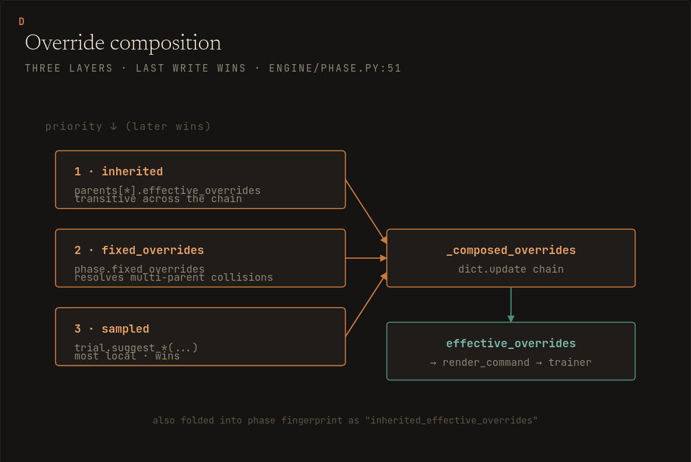

# Config Guide

A phasesweep config is the contract between the orchestrator and your trainer. The orchestrator chooses parameter values, manages trial directories, extracts evidence, and decides which winner is exposed downstream. Your trainer parses overrides, runs the experiment, and writes the artifacts that configured extractors read.

For every field, type, default, enum value, and validation constraint, use [config_reference.yaml](config_reference.yaml).

- [Experiment Keys](#experiment-keys)
- [Phase Keys](#phase-keys)
- [Search Parameters](#search-parameters)
- [Override Formats](#override-formats)
- [Trainer Contract](#trainer-contract)
- [Override Order](#override-order)
- [Extractors](#extractors)
- [Evidence Gates](#evidence-gates)
- [Promotion](#promotion)
- [Suites](#suites)
- [Validation](#validation)

## Experiment Keys

The top level of a single experiment describes identity, storage, the trial command contract, the objective, and the ordered phase plan. `experiment` is more than a display name: it is used in Optuna study names, output paths, and same-host lock identity, so it is restricted to ASCII `[A-Za-z0-9_-]+`.

`storage` controls whether a run can resume. `null` is in-memory and non-resumable. `sqlite:///path.db` is durable for sequential `n_jobs == 1` studies, but SQLite with parallel trials is rejected because concurrent Optuna writers are not a safe local parallel backend. Use `journal:///path.journal` for same-host parallel work, or an Optuna-supported RDB URL such as `postgresql://...` when you need durable external storage.

`trial_command` is the command template for one trial. The supported placeholders are `{overrides}`, `{overrides_path}`, `{trial_dir}`, `{trial_id}`, `{phase}`, and `{run_name}`. phasesweep validates the template at config load, then shell-quotes rendered override values. It does not teach your trainer to parse the chosen format; your trainer must already understand `argparse`, `hydra`, or the JSON file path you selected with `override_format`.

`metric` defines the objective name, optimization direction, and extractor. `constraints` are additional finite scalar extractors with inclusive `min` and/or `max` bounds. A trial that violates a constraint is still recorded as a completed evaluation with its raw objective value, but constraints are selection filters only: current samplers do not receive feasibility guidance, and infeasible trials cannot be selected as the phase winner. `contracts` are named bundles of fixed overrides and gates that phases can opt into when you need immutable comparison conditions across multiple phases.

The remaining top-level keys: `workdir` (default `./runs`) is the output root laid out in [runtime behavior](runtime.md#output-layout); `override_format` selects the trainer boundary covered in [Override Formats](#override-formats); `env` adds environment variables to every trial subprocess (included in semantic fingerprints); `timeout_seconds_per_run` is the whole-experiment wallclock guard described with the other timeouts in [runtime behavior](runtime.md#process-management).

## Phase Keys

Each phase is one Optuna study in an ordered chain. A phase may inherit winners from earlier phases; those inherited values become locked overrides for the current phase and for descendants. This greedy structure is useful for inspectable staged searches, but it is not a substitute for joint optimization when dimensions interact strongly.

- `name`: required phase name matching ASCII `[A-Za-z0-9_-]+`.
- `inherits`: prior phase names whose exposed winners become fixed overrides. Inheritance is transitive through each winner's `effective_overrides`: inheriting a phase also carries everything that phase itself inherited, so a linear chain only names its immediate predecessor.
- `fixed_overrides`: hard-coded overrides for every trial in the phase.
- `contracts`: top-level contracts applied to the phase. Contract keys cannot be resampled or locally overridden.
- `search_space`: override-key to sampler spec. Dotted keys such as `model.depth` are allowed.
- `n_trials`: terminal trial-attempt budget; Optuna `COMPLETE`, `FAIL`, and `PRUNED` trials all consume it. Increasing it later is a compatible top-up.
- `n_jobs`: parallel trials inside the phase.
- `gpu_policy`: `single_per_trial` leases one CUDA-visible token per trial, `whole_node` requires `n_jobs: 1` and exposes all configured or detected tokens to the trial, and `none` disables phasesweep CUDA isolation and GPU locks.
- `gpu_ids`: explicit non-negative CUDA device indices such as `[0, 1]`.
- `gpu_devices`: explicit opaque `CUDA_VISIBLE_DEVICES` tokens such as GPU UUIDs or MIG instance IDs. Use either `gpu_ids` or `gpu_devices`, not both. When both are omitted, ambient `CUDA_VISIBLE_DEVICES` tokens or `nvidia-smi` numeric output are auto-detected, including for `n_jobs == 1`.
- `max_consecutive_failures`: abort threshold for consecutive failed or infeasible trials.
- `sampler`: `tpe`, `random`, `grid`, or `cmaes`. `cmaes` is installed with the core package and is useful for continuous numeric phases.
- `timeout_seconds_per_trial`: per-trial process-group timeout. `null` requires `allow_unbounded_trials: true`.
- `timeout_seconds_per_phase`: hard phase wallclock guard. The budget caps Optuna scheduling, GPU-lease waiting, and active trial subprocess runtime.
- `allow_incomplete_on_timeout`: select from completed trials after a phase or run timeout. Defaults to fail-closed.
- `allow_partial_grid`: permit `n_trials` smaller than the grid cardinality.
- `allow_seed_search`: permit `seed` or `*.seed` in `search_space`.
- `gates`: evidence checks evaluated after metric and constraint extraction.
- `promotion`: compare the phase winner against an earlier exposed winner before downstream use.
- `comment`: design note shown by CLI commands. It is excluded from fingerprints.

## Search Parameters

`search_space` is a mapping from trainer override key to a typed parameter object. Keys can be dotted paths such as `model.depth`; the same key namespace is used for inherited winners, contracts, fixed overrides, and sampled values. phasesweep rejects ambiguous compositions such as fixing `model` while sampling `model.depth`, because no supported override format can represent that cleanly.

```yaml
search_space:
  lr: { type: float, low: 1.0e-5, high: 1.0e-2, log: true }
  depth: { type: int, low: 4, high: 16, step: 4 }
  activation: { type: categorical, choices: [gelu, relu] }
```

Float and integer bounds must be finite. Categorical choices must be Optuna-compatible scalars: `null`, booleans, integers, finite floats, or strings. Grid phases require a full grid unless `allow_partial_grid: true`; float grids require `step` and an evenly divisible interval. CMA-ES supports continuous numeric spaces only, so categorical parameters are rejected when `sampler.type: cmaes`.

## Override Formats

> [!IMPORTANT]
> The program launched by `trial_command` must parse the selected format. phasesweep renders values and validates placeholders; it does not adapt your trainer's CLI.

| Format      | Template placeholder | Trainer receives                     | Use when                                                         |
| ----------- | -------------------- | ------------------------------------ | ---------------------------------------------------------------- |
| `argparse`  | `{overrides}`        | `--key value` pairs                  | New scripts using `argparse`, Click, Typer, or similar parsers.  |
| `hydra`     | `{overrides}`        | `key=value` tokens                   | Compatibility for existing Hydra/OmegaConf applications.         |
| `json_file` | `{overrides_path}`   | Path to `<trial_dir>/overrides.json` | Recommended for structured config, nested values, MCP-launched sweeps, and agent-facing workflows. |

When a phase has inherited, fixed, or sampled overrides, `argparse` and `hydra` commands must include `{overrides}`. `json_file` commands must include `{overrides_path}`. Config validation rejects missing placeholders before any trial launches.

`json_file` is the most robust trainer boundary because it preserves JSON types without relying on a command-line grammar. Hydra compatibility quotes string and list values for OmegaConf override parsing, but complex structured values should use `json_file` rather than Hydra CLI overrides.

## Trainer Contract

The command in `trial_command` is the training or evaluation program for one trial. phasesweep creates the trial directory, renders overrides, launches the process group, captures stdout/stderr, and then reads evidence. The trial process inherits phasesweep's own working directory - the directory `phasesweep run` was invoked from, or the catalog's pinned `cwd` for MCP-launched runs - so relative paths in `trial_command` resolve against that directory. The trainer must:

- Parse the selected [override format](#override-formats).
- Write the metric artifact under `{trial_dir}` so the configured extractor can read it.
- Exit nonzero when the trial failed and should be recorded as failed.
- Use `PHASESWEEP_RUN_NAME` or the configured `run_name_template` when W&B extractors or W&B gates need to find the run.

Metric extractor failures, non-finite metrics, nonzero exits, and missing required evidence fail the trial. Constraint bound violations are different: they produce completed but infeasible trials. phasesweep records their raw objective values and constraint readings, but feasibility is applied during winner selection rather than sampler guidance. Winner selection takes the best-metric feasible completed trial; exact metric ties (within 1e-12) resolve to the lowest trial number. When a swept key turns out to have no effect on the metric, the promoted value is therefore just the first-evaluated choice, not evidence of a preference.

## Override Order



Within one trial, later layers override earlier layers:

1. Inherited winners' `effective_overrides`.
2. Contract `fixed_overrides`.
3. Phase `fixed_overrides`.
4. Sampled values from `search_space`.

A child phase may intentionally reset an inherited key with `fixed_overrides`. A sampled key cannot also be fixed or inherited.

## Extractors

Extractors turn trial artifacts into finite floats. JSON and log extractors read files under `{trial_dir}`. W&B extractors poll a completed run summary by name, so the trainer and config must agree on the run naming template.

For agent-facing workflows, keep extractor inputs to scalar summaries. Do not mix validation labels, target/dependent-variable values, prediction dumps, dataset paths, tokens, or full metric histories into the same artifact that stores the objective metric. MCP reads only the configured scalar, but small result artifacts are easier to inspect without leaking data into an agent chat or troubleshooting paste.

JSON extractors read a dotted key from a file under `{trial_dir}`:

```yaml
extractor: { type: json, path: result.json, key: eval.loss }
```

Log regex extractors read a captured numeric group named `value`:

```yaml
extractor:
  type: log_regex
  file: stdout.log
  pattern: 'eval_loss=(?P<value>[0-9.eE+-]+)'
  select: last
```

W&B extractors poll a completed run summary. The trainer should use `PHASESWEEP_RUN_NAME` or the same `run_name_template`.

```yaml
extractor:
  type: wandb
  entity: my-team
  project: tiny-lm
  run_name_template: '{experiment}-{phase}-{trial_id}'
  metric_key: eval/loss
  timeout_seconds: 300
```

## Evidence Gates

Supported gates are `required_file`, `json_equals`, `json_scalar_bound`, `artifact_size`, `sha256`, and `wandb_summary_required`. Gate failures mark the trial `FAIL` unless promotion has `requires_gates: false`, where they are advisory evidence.

`json_equals` is type-strict, so `true`, `1`, and `1.0` are distinct. Use `json_scalar_bound` for numeric comparisons where integer and float representations should both pass.

`artifact_size` requires `source: file|directory|json`. File and directory sources measure materialized bytes. JSON source reads an integer byte estimate from `path` plus `key`.

## Promotion

Promotion decides whether a phase or suite study winner is exposed downstream. The comparison uses signed improvement: for `minimize`, improvement is `baseline.metric - candidate.metric`; for `maximize`, it is `candidate.metric - baseline.metric`. The candidate promotes when improvement is at least `min_delta` and required gates passed.

```yaml
promotion:
  min_delta_vs: baseline
  min_delta: 0.01
  requires_gates: true
  on_fail: stop
```

`on_fail` can be `stop`, `skip`, or `continue_baseline`. Every promotion writes `<phase>/promotion.yaml`; exposed winners include the decision in `winner.yaml` and `summary.yaml`.

## Suites

Suites group independent or dependency-ordered studies under one run plan. Each study compiles to a normal experiment named `<suite>__<study>`, using defaults from `suite.defaults` when the study omits a field. Study `env` values merge over default `env`; study `contracts` merge over default `contracts`.

```yaml
suite: coreamp_ablation
defaults:
  workdir: ./runs
  trial_command: "python train.py --out {trial_dir}/result.json {overrides}"
  metric:
    name: bpb
    goal: minimize
    extractor: { type: json, path: result.json, key: eval.bpb }

studies:
  - name: baseline
    phases:
      - name: lr
        n_trials: 8
        search_space:
          lr: { type: float, low: 1.0e-5, high: 1.0e-3, log: true }

  - name: candidate
    depends_on: [baseline]
    promotion: { min_delta_vs: baseline, min_delta: 0.01, on_fail: stop }
    phases:
      - name: lr
        n_trials: 8
        search_space:
          lr: { type: float, low: 1.0e-5, high: 1.0e-3, log: true }
```

Suite runs write `<workdir>/<suite>/run.log` and `suite_summary.yaml`. Suite promotion `min_delta_vs` may name a prior study or `study.phase`; a bare study name resolves to that study's final phase.

## Validation

Config-load validation rejects graph errors, duplicate YAML keys, unknown object keys, unsafe override keys, dotted-key prefix collisions, sampler/search-space mismatches, SQLite parallel writes, seed searches by default, partial grids by default, missing override placeholders, non-finite bounds, and unknown contracts. Resume checks reject stale studies and incompatible persisted winners.
