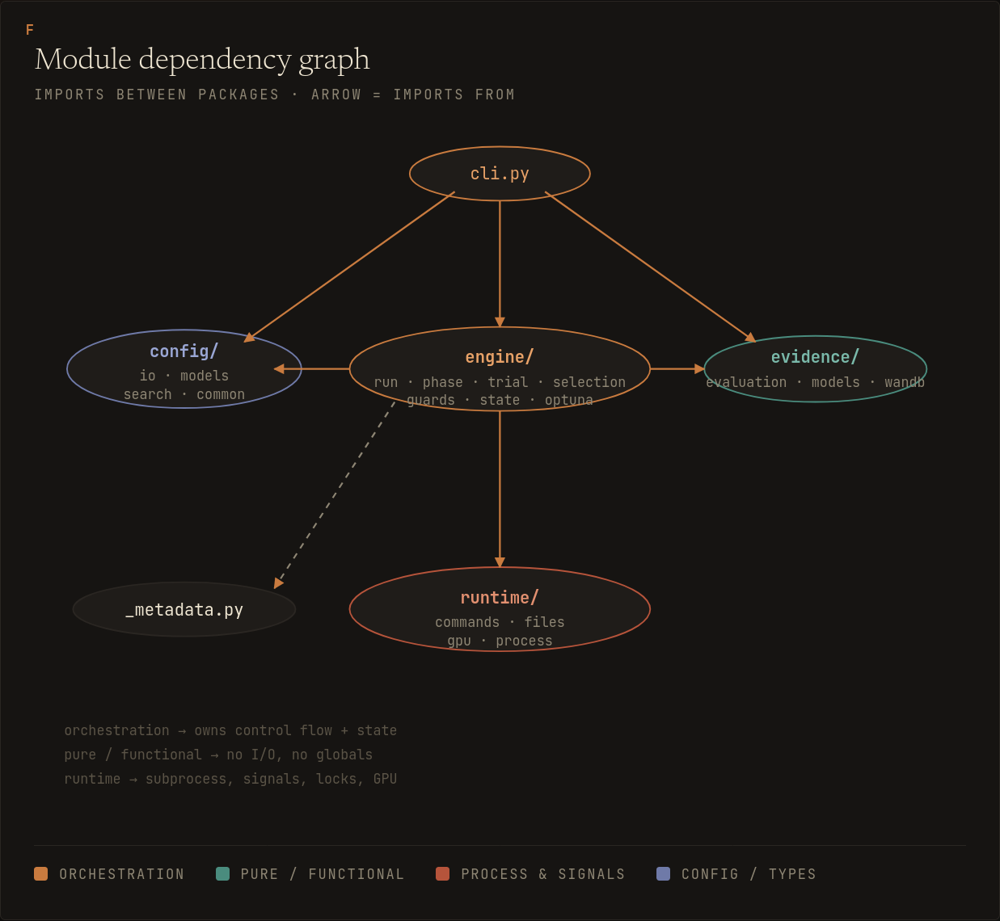
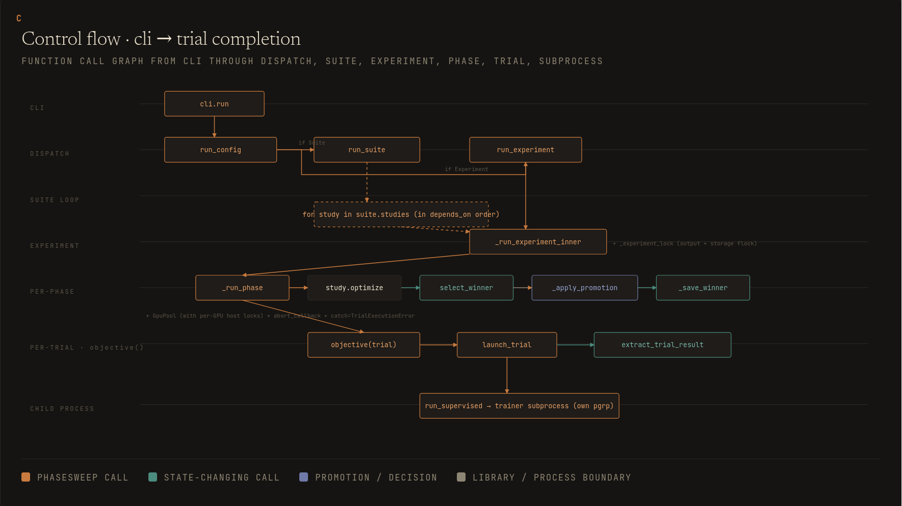

# Development

## Quality Gates

```bash
python -m pip install -e ".[dev]"
ruff check .
ruff format --check .
mypy src/phasesweep
pytest
```

Run `pytest` by itself, with no concurrent `ruff`, `mypy`, or other validation jobs. Some process-supervision and timeout tests are timing-sensitive and can fail under unrelated validation load. A clean full-suite run should not print a warning summary; investigate and fix new warnings instead of accepting them as background noise.

## Package Map



The package is organized by behavior:

- `phasesweep.config`: Pydantic config models and strict YAML loading.
- `phasesweep.engine`: Optuna study orchestration, fingerprints, locks, promotion, persistence, status, and suite execution.
- `phasesweep.evidence`: metric extractors, post-trial evidence gates, and W&B polling.
- `phasesweep.runtime`: subprocess, GPU, lock, storage URL, and override helpers.
- `phasesweep.mcp`: stdio MCP server, catalog registry, detached runner, run-handle store, and the client-config installer (`phasesweep.mcp.install`).
- `phasesweep.cli`: Click command surface.

Common package-root calls are `load_config`, `load_experiment`, `run_config`, `run_experiment`, `run_suite`, and `config_status`. Schema types are exported from `phasesweep.config`. Tests that need internals import direct submodules under `engine`, `evidence`, `runtime`, or `mcp`.

The control flow of a typical run is as follows:



## Test Map

Tests are organized by behavior:

- `tests/test_e2e.py`: full sweep and `--from-phase` replay.
- `tests/test_storage_urls.py`, `tests/test_locking.py`: storage identity, URL parsing, and same-host advisory locks.
- `tests/test_process_supervision.py`, `tests/test_stale_reaper.py`, `tests/test_trial_launch.py`: subprocess launch and cleanup, signal handling, startup/skipped-phase reaping.
- `tests/test_fingerprint.py`: semantic fingerprints, resume verification, run-control exclusions.
- `tests/test_filesystem_layout.py`: output namespace layout and experiment-name validation.
- `tests/test_param_validation.py`: search-space validation, override keys, sampler compatibility, grids, seeds, template placeholders.
- `tests/test_runtime_behavior.py`, `tests/test_protocol.py`, `tests/test_engine_read.py`: timeout policy, contracts, evidence gates, promotion, suites, and read-only engine views.
- `tests/test_mcp_*.py`: MCP catalog validation, preflight, and scaffolding; redaction; status timing and await_run; run handles; detached runner; server logic; the install/uninstall client-config flow; and e2e flow.
- `tests/test_config.py`, `tests/test_extractors.py`, `tests/test_overrides.py`, `tests/test_selector.py`, `tests/test_gpu_pool.py`, `tests/test_cli.py`: focused unit surfaces.

## Tracked TODOs

- TODO(runtime): Consider a trial bootstrap/exec handshake before claiming hard-crash durability for the `Popen` to identity-file window; normal exceptions and shutdown signals are cleaned up, but SIGKILL or host loss in that narrow interval cannot be repaired by the killed parent process.
- TODO(mcp): Remove the private FastMCP strict-schema patch once the `mcp` SDK exposes a tested public closed-input-schema API; until then keep the optional dependency pinned to the tested 1.27.x range and keep the behavior-level request-handler tests as the safety net.
- TODO(mcp): Split `mcp/server.py` into SDK-free application logic, schemas, launch lifecycle, and FastMCP adapter modules after the MCP alpha surface stabilizes.
- TODO(mcp): Add active-run indexing, archival, or bounded history pagination before treating thousands of historical MCP handles in one `state_dir` as a supported operating mode.
- TODO(mcp): Add an agent-visible run-listing or reattachment tool; today the `run_id` returned by launch is the only handle, so an agent that loses it mid-sweep (context reset) cannot rediscover its active run without operator help.
- TODO(mcp): Add an aggregated read-only trial-count path for JournalStorage before recommending very frequent `phasesweep_get_status` polling on very large local studies; external RDB-backed studies remain outside the MCP local-node support scope until multi-host cleanup and locking semantics are designed.
- TODO(runtime): Design an explicit `trial_budget_mode: complete` before promising `n_trials` successful objective evaluations; the current behavior intentionally matches Optuna's terminal-attempt budget, while a completion budget needs repeated optimize scheduling, a total-attempt safety cap, and clear interactions with pruning, infeasible-but-COMPLETE trials, max-consecutive-failure aborts, and wallclock deadlines.
- TODO(storage): Re-verify the direct SQLite status-query path against Optuna's trial-state schema whenever bumping Optuna beyond the currently tested range.
- TODO(example): Update the `examples/tiny_decoder_enwik8/upstream` submodule after the trainer template handles CPU/MPS autocast as fp32/disabled by default, uses CUDA-only `pin_memory`, moves batches with CUDA-only `non_blocking=True`, accumulates RMSNorm reductions in FP32, rejects overlong causal-mask sequence lengths, and unwraps `torch.compile` modules before checkpointing; keep those PyTorch training changes in the upstream trainer repo rather than patching the gitlink contents here.
