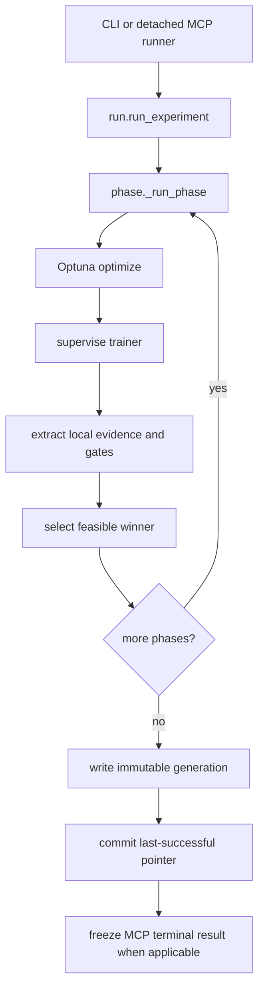

# Development

## Source checkout

```bash
git clone https://github.com/pszemraj/phasesweep.git
cd phasesweep
python -m pip install -e ".[dev]"
```

The `mcp` SDK is included in the development extra. Run Python-dependent
commands in the environment where you installed the project.

## Quality gates

Run the repository checks sequentially:

```bash
pytest
ruff check .
ruff format --check .
mypy src
scripts/check_installed_wheel.sh
```

Run `pytest` by itself, with no concurrent lint, type check, or build job:
process-supervision and timeout tests are timing-sensitive. The installed-wheel
script builds and installs into a temporary location, verifies the package and
console entry points outside the checkout, and exercises the starter's
validation, dry run, execution, replay, and catalog scaffolding. It leaves no
acceptance artifacts in the repository.

GitHub Actions intentionally has one Linux pull-request static-check job for
Ruff linting, Ruff format checking, and mypy. The full suite and installed
wheel check stay local to control CI cost. Hardware tests remain opt-in.

The supported Optuna range is `>=4.0,<4.10`. PhaseSweep's local storage and
read-only inspection behavior depends on that range; do not widen it without
targeted validation.

## Package map

- `phasesweep.config`: Pydantic Experiment models and strict YAML loading.
- `phasesweep.engine`: phase orchestration, fingerprints, local persistence,
  immutable generation publication, and read-only status.
- `phasesweep.evidence`: local objective extraction and post-trial gates.
- `phasesweep.reporting`: trainer-side JSON-envelope objective writer.
- `phasesweep.runtime`: subprocess supervision, GPU leases, locks, local
  storage URLs, and override rendering.
- `phasesweep.mcp`: catalog registry, stdio server, detached runner, durable
  run handles, frozen snapshots, and operator recovery.
- `phasesweep.cli`: Click command surface.

Common package-root calls are `load_config`, `load_experiment`, `run_config`,
`run_experiment`, and `config_status`. Schema types are exported from
`phasesweep.config`. Tests that need internals import direct modules under
`engine`, `evidence`, `runtime`, or `mcp`.

Within `phasesweep.engine`, module ownership is intentionally direct:

| Responsibility | Modules |
| --- | --- |
| Experiment and phase orchestration | `run`, `phase` |
| Resume selection and continuation preflight | `resume`, `study_policy`, `guards` |
| Locks and stale-attempt cleanup | `locking`, `attempts`, `cleanup` |
| Root ownership and retained evidence checks | `artifact_roots`, `evidence` |
| Paths, state records, and fingerprints | `paths`, `state`, `fingerprints` |
| Publication and read-only views | `generation`, `publication`, `publication_validation`, `read` |

`mcp.recovery.recover_run` implements [operator recovery](mcp.md#run-state-and-recovery);
the CLI owns its arguments and rendering.

The ordinary control flow is:


```mermaid
flowchart TD
    cli["CLI or detached MCP runner"] --> run["run.run_experiment"]
    run --> phase["phase._run_phase"]
    phase --> optimize["Optuna optimize"]
    optimize --> launch["supervise trainer"]
    launch --> evidence["extract local evidence and gates"]
    evidence --> select["select feasible winner"]
    select --> next{"more phases?"}
    next -->|yes| phase
    next -->|no| generation["write immutable generation"]
    generation --> pointer["commit last-successful pointer"]
    pointer --> snapshot["freeze MCP terminal result when applicable"]
```

## Test map

- `tests/test_e2e.py`: complete experiment and `--from-phase` replay.
- `tests/test_config.py`, `tests/test_param_validation.py`, and
  `tests/test_overrides.py`: Experiment validation, composition, parameter
  domains, and retained input boundaries.
- `tests/test_extractors.py`, `tests/test_trial_evidence.py`, and
  `tests/test_trial_launch.py`: local evidence, gates, and supervised trials.
- `tests/test_fingerprint.py`, `tests/test_runtime_behavior.py`,
  `tests/test_publication_transaction.py`, and `tests/test_engine_read.py`:
  continuation, current-format publication, and read-only views.
- `tests/test_storage_urls.py`, `tests/test_locking.py`, and
  `tests/test_filesystem_layout.py`: local storage, locks, format cutover, and
  output layout.
- `tests/test_mcp_*.py`: catalog validation, run state, frozen snapshots,
  detached launch, status, cancellation, and recovery.
- `tests/test_init.py` and `tests/test_reporting.py`: starter creation,
  catalog scaffolding, and result rendering.

## Tracked TODOs

- TODO(mcp): Replace the private FastMCP strict-schema patch when the SDK
  exposes a tested public closed-input-schema API; keep behavior-level request
  validation as the safety net until then.
- TODO(mcp): Split `mcp/server.py` after the MCP SDK surface stabilizes, without
  changing its run-handle or snapshot semantics.
- TODO(runtime): Design an explicit completion-budget mode only if its attempt
  accounting, failure cap, and timeout semantics are specified separately.
- TODO(runtime): Add a deliberately scoped generation-pruning command only if
  it preserves the current last-successful pointer and all cited winner
  provenance.
