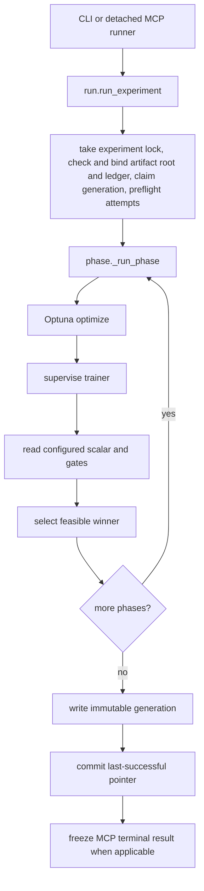

# Development

## Source checkout

```bash
git clone https://github.com/pszemraj/phasesweep.git
cd phasesweep
python -m pip install -e ".[dev,wandb]"
```

The development extra includes MCP and Hydra for integration checks; the
optional W&B extra exercises the installed SDK. Run Python-dependent commands
in the environment where you installed the project.

## Quality gates

Run the repository checks sequentially:

```bash
pytest
ruff check .
ruff format --check .
mypy src
scripts/check_installed_wheel.sh
```

> [!IMPORTANT]
> Run `pytest` by itself, with no concurrent lint, type check, or build job:
> process-supervision and timeout tests are timing-sensitive.

The installed-wheel script builds and installs into a temporary location,
verifies the package and console entry points outside the checkout, and
exercises the starter's validation, dry run, execution, replay, and catalog
scaffolding. It leaves no acceptance artifacts in the repository.

### Git hooks

The [hook configuration](../.pre-commit-config.yaml) calls the tools installed
in the active environment and builds none of its own, so commit from a shell
with that environment active. The development extra provides `pre-commit` and
`pathlint`; after installing it, enable the hooks once per clone:

```bash
pre-commit install
```

| Hook | Stage | Runs on |
| --- | --- | --- |
| `ruff check --fix`, `ruff format` | commit | changed Python files |
| `pathlint` | commit | changed `src/` and `tests/` Python files |
| `doc-check` | commit | changed `src/` Python files, with `--strict` |
| module size | commit | changed `src/` Python files |
| contract tests | commit | every commit |
| tier guard | commit | every commit, collecting the whole suite |
| `mypy src` | push | the whole package |

The contract tests are `tests/test_ledger_contract.py`,
`tests/test_error_routing.py`, and `tests/test_tier_guard.py`. The tier guard
collects the whole suite without running it, which applies the
[integration-marker guard](#test-tiers) to every test module. `doc-check` runs
the maintainer script `~/scripts/py/doc_check.py` when it exists; otherwise the
hook prints that it skipped. It is a maintainer-local check, and CI does not
run it. The module-size hook refuses a commit that touches
a `src/` module longer than 2000 lines, so split a module before changing it;
[`scripts/check_module_size.sh`](../scripts/check_module_size.sh) holds the
limit. When Ruff rewrites a file, the commit stops; stage the fix and commit
again.

`pre-commit run --all-files` runs the commit hooks over the whole tree;
add `--hook-stage pre-push` for mypy. The hooks are a fast subset, and plain
`pytest` remains the full gate.

### Test tiers

Plain `pytest` above is the authoritative non-hardware suite and stays the
merge and release check. While iterating, two subsets are available:

```bash
pytest -m "not hardware and not integration"   # fast review tier
pytest -m "integration and not hardware"       # integration tier only
```

> [!NOTE]
> A `-m` on the command line *replaces* the `-m 'not hardware'` in `addopts`
> rather than adding to it, which is why both commands above spell out
> `not hardware`.

A test is `@pytest.mark.integration` when it manages real processes, waits on
wall-clock time, drives a multi-step durable recovery workflow, or is otherwise
slow: its call phase takes at least `SLOW_CALL_SECONDS` from `tests/tiers.py`.
Everything else stays in the fast tier, including engine runs with quick
trainers, such as `run_experiment` over an `echo` trainer, which spawn their
subprocess inside the package.

The guard enforces only what a test's source shows: `tests/conftest.py` fails
collection when a test manages processes or waits on the clock *directly*, in
its body or a same-module helper or fixture, without the marker
(`tests/tiers.py` lists the primitives). A test that is slow for any other
reason is marked by the classification rule above. To keep one visible, a run
that excludes `integration` ends with a list of unmarked tests at or over the
threshold. The list is a report, not a failure, because timing thresholds
flake on loaded hosts.

GitHub Actions intentionally has one Linux pull-request static-check job for
Ruff linting, Ruff format checking, mypy, the whole-suite collection the tier
guard hook runs, and the three contract tests plus
`tests/test_ledger_read_paths.py`, all imported from `src/` without building
the package. The full suite and installed wheel check stay local to control CI
cost. Hardware tests remain opt-in.

The supported Optuna range is `>=4.0,<4.10`. PhaseSweep's local storage and
read-only inspection behavior depends on that range; do not widen it without
targeted validation.

The W&B reader supports `>=0.28,<0.29`. Tests exercise that SDK's
summary decoding and error behavior with controlled responses, plus supervised
worker fixtures for deadlines, cleanup faults, and recovery. They do not certify
live service access. Input tests use the real Hydra 1.3 parser and entrypoint;
rendering itself has no Hydra runtime dependency.

### Manual W&B-only training acceptance

With PyTorch already available and access to an authorized W&B project, manually
run the [acceptance driver](../scripts/accept_wandb_training.py) in a fresh
temporary output directory:

```bash
python scripts/accept_wandb_training.py \
  --entity YOUR_ENTITY --project YOUR_PROJECT \
  --workdir /tmp/phasesweep-wandb-acceptance
```

To exercise one GPU lease across the same four sequential attempts, use a fresh
work directory and select a host GPU:

```bash
python scripts/accept_wandb_training.py \
  --entity YOUR_ENTITY --project YOUR_PROJECT \
  --device cuda --gpu-id 0 \
  --workdir /tmp/phasesweep-wandb-gpu-acceptance
```

This makes four sequential training runs on the selected device. The
[standalone trainer](../examples/wandb_linear_train.py) fits one weight to
`y = 2x` using 64 fixed examples and 20 full-batch SGD steps, then evaluates
32 held-out examples. Phase one compares learning rates 0.01 and 0.1; phase two
inherits the winner and compares weight decay 0 and 0.01. Its objective goes
only to W&B; its parameter receipt remains parameters-only, and a separate
device receipt confirms where the model and tensors executed. There is no
PhaseSweep trainer import, objective mirror, or dataset download.

The driver prints its launch budget, checks the four attempt identities,
targets, finite measured scores, minimization, publication, consumed inherited
parameters, and replay without more trials or remote reads. Trainer and poll
caps are each 120 seconds, phase caps 600 seconds, and the experiment cap 1,200
seconds; process cleanup grace remains separate. This manual service check is
outside both the default suite and CI. Unavailable live access is a blocked
acceptance result, not evidence of service readiness.

## Package map

- `phasesweep.config`: Pydantic Experiment models and strict YAML loading.
- `phasesweep.engine`: phase orchestration, fingerprints, local persistence,
  immutable generation publication, and read-only status.
- `phasesweep.evidence`: JSON, envelope, log, and supervised W&B extraction and gates.
- `phasesweep.reporting`: trainer-side JSON-envelope objective writer.
- `phasesweep.runtime`: subprocess supervision, GPU leases, locks, local
  storage URLs, and override rendering.
- `phasesweep.mcp`: catalog registry, stdio server, detached runner, durable
  run handles, frozen snapshots, and operator recovery.
- `phasesweep.cli`: Click command surface.

Common package-root calls are `load_config`, `load_experiment`, `run_config`,
`run_experiment`, and `config_status`. Schema types are exported from
`phasesweep.config`. Tests that need internals import direct modules under
`engine`, `evidence`, `runtime`, or `mcp`.

Within `phasesweep.engine`, module ownership is intentionally direct:

| Responsibility | Modules |
| --- | --- |
| Experiment and phase orchestration | `run`, `phase` |
| Resume selection and continuation preflight | `resume`, `study_policy`, `guards` |
| Ledger storage: the only module that constructs Optuna or SQLite storage | `ledger` |
| Locks and stale-attempt cleanup | `locking`, `attempts`, `cleanup` |
| Root ownership and retained evidence checks | `artifact_roots`, `evidence` |
| Paths, state records, and fingerprints | `paths`, `state`, `fingerprints` |
| Publication and read-only views | `generation`, `publication`, `publication_validation`, `read` |

`mcp.recovery.recover_run` implements [operator recovery](mcp.md#run-state-and-recovery);
the CLI owns its arguments and rendering.

The ordering rules these modules must hold, and the test that owns each one,
are listed in [durability invariants](invariants.md).

The ordinary control flow is:


```mermaid
flowchart TD
    cli["CLI or detached MCP runner"] --> run["run.run_experiment"]
    run --> preflight["take experiment lock, check and bind artifact root and ledger, claim generation, preflight attempts"]
    preflight --> phase["phase._run_phase"]
    phase --> optimize["Optuna optimize"]
    optimize --> launch["supervise trainer"]
    launch --> evidence["read configured scalar and gates"]
    evidence --> select["select feasible winner"]
    select --> next{"more phases?"}
    next -->|yes| phase
    next -->|no| generation["write immutable generation"]
    generation --> pointer["commit last-successful pointer"]
    pointer --> snapshot["freeze MCP terminal result when applicable"]
```

## Test map

- `tests/test_e2e.py`: complete experiment and `--from-phase` replay.
- `tests/test_config.py`, `tests/test_param_validation.py`, and
  `tests/test_overrides.py`: Experiment validation, composition, parameter
  domains, and retained input boundaries.
- `tests/test_extractors.py`, `tests/test_trial_evidence.py`, and
  `tests/test_trial_launch.py`: scalar evidence, shared W&B captures, gates,
  supervised trials, and durable input verification.
- `tests/test_fingerprint.py`, `tests/test_runtime_behavior.py`,
  `tests/test_publication_transaction.py`, and `tests/test_engine_read.py`:
  continuation, current-format publication, and read-only views.
- `tests/test_storage_urls.py`, `tests/test_locking.py`,
  `tests/test_filesystem_layout.py`, and `tests/test_format_cutover.py`: local
  storage, locks, format cutover, and output layout.
- `tests/test_ledger_contract.py`, `tests/test_ledger_read_paths.py`,
  `tests/test_error_routing.py`, and `tests/test_tier_guard.py`: the storage
  chokepoint, read paths and recovery inspection against golden ledger
  fixtures, operator-action routing, and the integration-marker guard.
- `tests/test_mcp_*.py`: catalog validation, run state, frozen snapshots,
  detached launch, status, cancellation, and recovery.
- `tests/test_init.py` and `tests/test_reporting.py`: starter creation,
  catalog scaffolding, and result rendering.

## Tracked TODOs

- TODO(mcp): Replace the private FastMCP strict-schema patch when the SDK
  exposes a tested public closed-input-schema API; keep behavior-level request
  validation as the safety net until then.
- TODO(mcp): Split `mcp/server.py` after the MCP SDK surface stabilizes, without
  changing its run-handle or snapshot semantics.
- TODO(runtime): Design an explicit completion-budget mode only if its attempt
  accounting, failure cap, and timeout semantics are specified separately.
- TODO(runtime): Add a deliberately scoped generation-pruning command only if
  it preserves the current last-successful pointer and all cited winner
  provenance.
- TODO(engine): Keep [durability invariants](invariants.md) in step with the
  ledger chokepoint. A storage constructor outside `engine/ledger.py` already
  fails `tests/test_ledger_contract.py`, but a new ordering rule or ledger
  entry point needs its own invariant entry, citing the code and the test
  that hold it.
