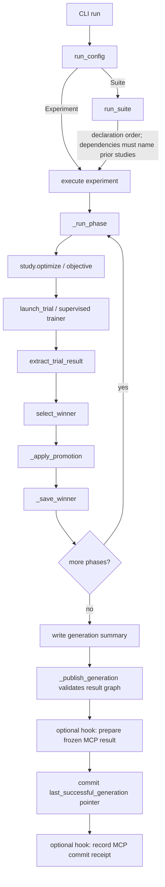

# Development

## Source checkout

```bash
git clone https://github.com/pszemraj/phasesweep.git
cd phasesweep
python -m pip install -e ".[dev,wandb]"
```

The `mcp` SDK is included in the development extra. Run Python-dependent commands in the environment where you installed the project.

## Quality gates

Run the repository's checks sequentially:

```bash
pytest
ruff check .
ruff format --check .
mypy src
scripts/check_installed_wheel.sh
```

The final script builds a wheel in a temporary directory, asserts its packaged-data members retain public read bits, installs it into a temporary prefix, checks that the installed version matches the one `git describe` implies for the checkout, verifies both console entry points and packaged-data presence, and exercises `phasesweep init`, validation, dry-run, and catalog scaffolding without relying on the checkout at runtime. Every assertion prints a `check_installed_wheel:` diagnostic before exiting non-zero. It leaves no build or acceptance artifact in the repository.

Run `pytest` by itself, with no concurrent lint, type-check, or build jobs. Some process-supervision and timeout tests are timing-sensitive and can fail under unrelated validation load. A clean full-suite run should not print a warning summary; investigate and fix new warnings instead of accepting them as background noise. There is currently no CI workflow, Makefile, or justfile wrapping these commands.

The supported Optuna range is `>=4.0,<4.10`. PhaseSweep reads SQL storage schemas directly for read-only status and relies on sampler/storage behavior, so run the full suite at both dependency endpoints before widening that range.

## Package map

The package is organized by behavior:

- `phasesweep.config`: Pydantic config models and strict YAML loading.
- `phasesweep.engine`: Optuna study orchestration, fingerprints, locks, promotion, persistence, status, and suite execution.
- `phasesweep.evidence`: metric extractors, post-trial evidence gates, and W&B polling.
- `phasesweep.reporting`: the trainer-side objective-envelope writer.
- `phasesweep.runtime`: subprocess, GPU, lock, storage URL, and override helpers.
- `phasesweep.mcp`: stdio MCP server, catalog registry, detached runner, run-handle store, and the client-config installer (`phasesweep.mcp.install`).
- `phasesweep.cli`: Click command surface.

Common package-root calls are `load_config`, `load_experiment`, `run_config`, `run_experiment`, `run_suite`, and `config_status`. Schema types are exported from `phasesweep.config`. Tests that need internals import direct submodules under `engine`, `evidence`, `runtime`, or `mcp`.

The control flow of a typical run is:


```mermaid
flowchart TD
    cli["CLI run"] --> dispatch["run_config"]
    dispatch -->|Experiment| experiment["execute experiment"]
    dispatch -->|Suite| suite["run_suite"]
    suite -->|"declaration order; dependencies must name prior studies"| experiment
    experiment --> phase["_run_phase"]
    phase --> optimize["study.optimize / objective"]
    optimize --> launch["launch_trial / supervised trainer"]
    launch --> evidence["extract_trial_result"]
    evidence --> select["select_winner"]
    select --> promote["_apply_promotion"]
    promote --> winner["_save_winner"]
    winner --> more{"more phases?"}
    more -->|yes| phase
    more -->|no| summary["write generation summary"]
    summary --> publish["_publish_generation validates result graph"]
    publish --> sidecar["optional hook: prepare frozen MCP result"]
    sidecar --> pointer["commit last_successful_generation pointer"]
    pointer --> receipt["optional hook: record MCP commit receipt"]
```

For suites, each executed component experiment completes this publication sequence before suite promotion is evaluated. After the declared-study loop completes, the engine validates and publishes the suite summary through its own last-success pointer.

## Test map

Tests are organized by behavior:

- `tests/test_e2e.py`: full sweep and `--from-phase` replay.
- `tests/test_storage_urls.py`, `tests/test_locking.py`: storage identity, URL parsing, and same-host advisory locks.
- `tests/test_process_supervision.py`, `tests/test_stale_reaper.py`, `tests/test_trial_launch.py`: subprocess launch and cleanup, signal handling, reached/skipped-phase reaping.
- `tests/test_fingerprint.py`: semantic fingerprints, resume verification, run-control exclusions.
- `tests/test_filesystem_layout.py`: output namespace layout and experiment-name validation.
- `tests/test_param_validation.py`: search-space validation, override keys, sampler compatibility, grids, seeds, template placeholders.
- `tests/test_runtime_behavior.py`, `tests/test_protocol.py`, `tests/test_engine_read.py`, `tests/test_engine_status_shape.py`, `tests/test_publication_transaction.py`, `tests/test_trial_evidence.py`: timeout policy, contracts, evidence gates, promotion, suites, publication transactions, evidence-integrity guards, and read-only engine views.
- `tests/test_mcp_*.py`: MCP catalog validation, preflight, and scaffolding; redaction; status timing and await_run; run handles; detached runner; server logic; the install/uninstall client-config flow; and e2e flow.
- `tests/test_init.py`: starter creation, validation, dry-run, catalog scaffolding, output placement, and overwrite refusal.
- `tests/test_reporting.py`: summary rendering, winner manifests, and report serialization.
- `tests/test_tiny_decoder_example.py`: adapter composition, attempt-scoped final-checkpoint result envelopes, zero-seed handling, and empty-validation rejection.
- `tests/test_config.py`, `tests/test_extractors.py`, `tests/test_overrides.py`, `tests/test_selector.py`, `tests/test_gpu_pool.py`, `tests/test_cli.py`, `tests/test_public_metadata.py`: focused unit surfaces.

## Tracked TODOs

- TODO(mcp): Remove the private FastMCP strict-schema patch once the `mcp` SDK exposes a tested public closed-input-schema API; until then keep the optional dependency pinned to the tested 1.27.x range and keep the behavior-level request-handler tests as the safety net.
- TODO(mcp): Split `mcp/server.py` into SDK-free application logic, schemas, launch lifecycle, and FastMCP adapter modules after the MCP alpha surface stabilizes.
- TODO(mcp): Add active-run indexing, archival, or bounded history pagination before treating thousands of historical MCP handles in one `state_dir` as a supported operating mode.
- TODO(mcp): Add an aggregated read-only trial-count path for JournalStorage before recommending very frequent `get_run_status` polling on very large local studies; external RDB-backed studies remain outside the MCP local-node support scope until multi-host cleanup and locking semantics are designed.
- TODO(runtime): Design an explicit `trial_budget_mode: complete` before promising `n_trials` successful objective evaluations; the current behavior intentionally matches Optuna's terminal-attempt budget, while a completion budget needs repeated optimize scheduling, a total-attempt safety cap, and clear interactions with pruning, infeasible-but-COMPLETE trials, max-consecutive-failure aborts, and wallclock deadlines.
- TODO(runtime): Make an artifact tree genuinely relocatable instead of only rebindable. Trial directories, active-attempt registry entries, and published suite summaries all persist *absolute* paths that are read back verbatim (`phasesweep_trial_dir`, the registry `trial_dir` field, and a suite summary's `component_summary_path`), so a moved tree silently invalidates recovery and suite publication. The full fix is: persist those paths relative to the artifact root; record a durable relocation record and route every read through one centralized resolver rather than raw `Path(stored)` reads; publish a metadata-only replacement suite generation for a relocated suite so its component references point at the new tree; and make the migration itself a prepared/committed record so a storage failure part-way through is retryable rather than leaving mixed state. Until then `phasesweep rebind-workdir` deliberately refuses what it cannot verify - stale or incomplete copies, RUNNING trials during relocation (with a narrow in-place adoption exception), unresolved attempts, and any suite that may have published.
- TODO(storage): Re-verify the direct SQLite status-query path, Journal reads, study attributes, trial-state counts, and sampler policies before widening the tested Optuna upper bound.
- TODO(runtime): Add a `phasesweep prune --keep-last N` command for generation-namespace growth: immutable `generations/<id>/` namespaces accumulate one directory per invocation and nothing deletes them today. Pruning must refuse to remove the generation the last-success pointer targets or any ancestor generation transitively cited by its carried winners, must not touch trial directories (they are evidence, not generation state), and should report what it kept and why.
- TODO(example): Update the `examples/tiny_decoder_enwik8/upstream` submodule after the trainer template handles `seed: 0`, CPU/MPS autocast as fp32/disabled by default, uses CUDA-only `pin_memory`, moves batches with CUDA-only `non_blocking=True`, accumulates RMSNorm reductions in FP32, rejects overlong causal-mask sequence lengths, and unwraps `torch.compile` modules before checkpointing; keep those PyTorch training changes in the upstream trainer repo rather than patching the gitlink contents here.
