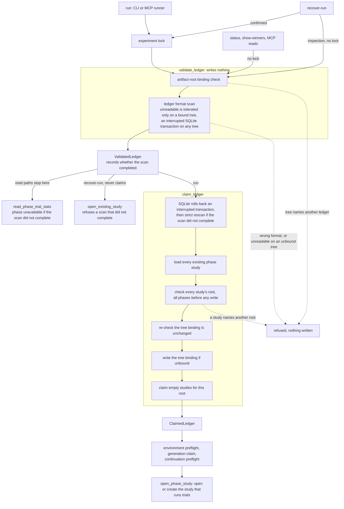

# Durability invariants

PhaseSweep's local ledger, artifact-root binding, publication transaction, and
operator recovery are where a wrong ordering silently destroys work. Every rule
on this page names the code that holds it and the test that fails when it stops
holding, so breaking one fails a test instead of waiting for a reviewer to
notice.

## Agent handoff

Paste this block into the instructions of any agent that changes the engine or
the MCP layer.

```text
1. Mutating paths (a run, and recover-run when confirmed) take the experiment
   lock before they touch the artifact tree or the ledger. Read paths and
   recovery inspection take no lock, so they must write nothing.
2. Validate, then claim, then open. validate_ledger checks the artifact-root
   binding, then scans the ledger format, and writes nothing; on a bound tree
   an unreadable scan is tolerated and recorded on the handle, and so is an
   interrupted SQLite transaction on any tree. claim_ledger lets SQLite roll
   that transaction back, rescans strictly if the scan did not complete,
   loads every existing phase study, checks every study's root before any
   write, writes the tree binding, then claims empty studies. Only the
   ClaimedLedger it returns reaches open_phase_study.
3. Pure read paths (read_status, read_winners, CLI status and show-winners,
   the MCP result snapshot) never construct file-backed storage and never
   write bytes. Recovery inspection validates binding and format before any
   open and refuses a pre-cutover ledger with the bytes unchanged.
4. Only src/phasesweep/engine/ledger.py may construct Optuna or sqlite3
   storage, and no other module imports its private names.
   tests/test_ledger_contract.py enforces both, and its ratchets are empty,
   so a new site anywhere else fails.
```

> [!IMPORTANT]
> Error text is authoritative, and a wrap preserves the operator's remediation.
> Never fix a failing test by weakening a message match or an ordering
> assertion.

## Invariants

Module paths below drop the `phasesweep.` prefix; test paths are relative to
the repository root.

### Lock and ledger order

Every path into the ledger passes through `engine.ledger`, and the handle each
step returns is the proof the earlier steps ran. The diagram shows where each
caller enters and where it must stop.



#### 1. Mutations hold the experiment lock

A run, and a `recover-run` the operator confirms, hold the experiment lock
before they read or write the artifact tree or the ledger.

**Held by:** `engine.locking._experiment_lock`, entered as the outermost
durable-state context in `engine.run._run_experiment_outcome`, and in
`mcp.recovery.recover_run` only when the operator confirms\
**Test:** `tests/test_locking.py::test_run_experiment_holds_experiment_lock_for_duration`

#### 2. Validation writes nothing

`validate_ledger` checks the artifact-root binding, then scans the ledger
format, and writes nothing; on a bound tree an unreadable scan is tolerated and
recorded on the handle, and on an unbound tree it is refused.

A crash in the middle of a SQLite commit leaves a hot journal that only a
read-write open rolls back, so the `mode=ro` scan records it on either tree as
`LedgerTransactionInterruptedError`. A locked mutating path then lets SQLite
finish its own crash recovery before it rescans: one read-write open of the
existing file that cannot create it. Read paths never make that open; they
report the ledger unavailable with that reason and leave the ledger and its
journal byte-identical.

A journal ledger's last line that lacks its newline or does not decode is
skipped exactly as Optuna's reader skips it, so status, winners, and the
result snapshot report the complete records. Every path that may write refuses
it before any live open, naming the byte to truncate at, and so does recovery,
inspection or confirmed, because inspection previews a mutation. Nothing
repairs it automatically. The experiment lock does not exclude another
experiment's append to a shared journal, so the line may be an append still in
flight, and truncating it would destroy a live record. Only the file lock
Optuna's journal backend takes for every append excludes all writers, and
PhaseSweep does not take it.

**Held by:** `engine.ledger.validate_ledger`, running
`engine.artifact_roots._check_artifact_root_binding` before
`engine.ledger._scan_ledger_format` and returning a `ValidatedLedger` whose
`format_verified` and `format_scan_failure` record the outcome;
`engine.ledger.roll_back_interrupted_transaction`, called by `claim_ledger` and
confirmed recovery, and the same open in `engine.ledger.open_registry_study`;
`engine.ledger._journal_records` for the tolerated line and
`engine.ledger.require_complete_journal` for the refusal\
**Tests:** `tests/test_format_cutover.py::test_validate_ledger_on_a_fresh_root_creates_nothing`,
`tests/test_format_cutover.py::test_unverified_handle_records_the_gap_and_opens_nothing_live`,
`tests/test_ledger_read_paths.py::test_read_path_never_constructs_file_backed_storage_or_writes_bytes`
(its `release-0.3.1` cells pin the binding check before the format scan),
`tests/test_format_cutover.py::test_reads_report_an_interrupted_transaction_and_leave_it_for_a_locked_path`,
`tests/test_format_cutover.py::test_run_rolls_back_an_interrupted_transaction_and_continues`,
`tests/test_format_cutover.py::test_claim_on_an_unbound_tree_rolls_back_a_shared_ledger`,
`tests/test_format_cutover.py::test_registry_opener_rolls_back_an_interrupted_transaction`,
`tests/test_format_cutover.py::test_rollback_open_never_creates_a_missing_ledger`,
`tests/test_engine_read.py::test_journal_partial_final_record_reads_as_optuna_does_and_blocks_writes`,
`tests/test_engine_read.py::test_journal_malformed_record_before_its_end_never_means_absent`,
`tests/test_format_cutover.py::test_writers_refuse_a_partial_final_journal_record_and_leave_it`

The scan may read a missing SQLite file as an absent ledger only because every
accepted SQLite URL names a local file: config load refuses a URI filename
that names another host (`config.models.Experiment._storage_is_local`, tested
by `tests/test_storage_urls.py::test_sqlite_uri_with_remote_authority_is_rejected_at_config_load`).
The file it names is also the one Optuna writes: config load refuses a URL
that SQLAlchemy's SQLite dialect maps to a different database than
`runtime.files.sqlite_database_path` does, as well as a repeated option and a
`vfs` (`config.models._require_one_sqlite_database`, tested by
`tests/test_storage_urls.py::test_sqlite_url_read_differently_by_sqlalchemy_is_rejected_at_config_load`).

#### 3. Only a claimed ledger runs trials

Only a `ClaimedLedger` can open a study that runs new trials, and
`claim_ledger` rescans strictly before it trusts a scan that did not complete.

**Held by:** `engine.ledger.claim_ledger` returning `ClaimedLedger`;
`engine.ledger.open_phase_study`, which raises `TypeError` for any other
handle; `engine.ledger.open_preview_study`, which is in-memory and serves dry
runs\
**Tests:** `tests/test_format_cutover.py::test_live_openers_reject_unvalidated_storage`,
`tests/test_format_cutover.py::test_claim_ledger_binds_tree_then_returns_bound_handle`,
`tests/test_format_cutover.py::test_claim_rescans_an_unverified_ledger_before_discovery`,
`tests/test_ledger_contract.py::test_storage_constructors_are_called_only_in_the_ledger_module`

#### 4. Both ownership directions agree before any write

The tree binding must name this ledger and every existing phase study must
name this root, checked for all phases before anything is written.

**Held by:** `engine.artifact_roots._check_artifact_root_binding` in
`validate_ledger`, then `engine.artifact_roots._artifact_root_claim_needed`
for every loaded study and a re-check of the binding in `claim_ledger`\
**Tests:** `tests/test_fingerprint.py::test_second_workdir_is_rejected_and_leaves_the_bound_root_untouched`,
`tests/test_fingerprint.py::test_refused_multi_phase_binding_claims_nothing`

#### 5. The tree is bound before any study

`claim_ledger` writes the tree binding before it claims any study, so a crash
between the two cannot leave a study naming a tree that does not name its
ledger. Its first write, before the binding, creates the ledger's directory
for either backend, so a ledger path that cannot hold a file fails while the
tree is still unbound and the path can be corrected.

**Held by:** `engine.ledger.claim_ledger`, creating the ledger's parent
directory, then calling `engine.artifact_roots._write_artifact_root_binding`
before its `_claim_study_artifact_root` loop\
**Tests:** `tests/test_format_cutover.py::test_claim_ledger_writes_tree_binding_before_claiming_studies`,
`tests/test_format_cutover.py::test_claim_ledger_creates_ledger_parent_but_validate_does_not`,
`tests/test_format_cutover.py::test_unwritable_ledger_directory_fails_before_the_tree_is_bound`

#### 6. Read paths construct and write nothing

`read_status`, `read_winners`, CLI `status` and `show-winners`, and the MCP
result snapshot build no file-backed storage, write no bytes, and report a
phase whose format scan did not complete as unavailable rather than counting
its trials. The one exception is a SQLite ledger someone switched to WAL mode,
which Optuna never does: a read there leaves the database bytes unchanged,
but SQLite itself creates the `-wal` and `-shm` files it coordinates readers
through.

**Held by:** `engine.ledger.validate_ledger` and
`engine.ledger.read_phase_trial_stats`, under `engine.read.read_status`,
`engine.read.read_winners`, and `mcp.snapshots.capture_result_snapshot`\
**Tests:** `tests/test_ledger_read_paths.py::test_read_path_never_constructs_file_backed_storage_or_writes_bytes`,
`tests/test_format_cutover.py::test_inconclusive_scan_on_a_bound_tree_never_reports_unchecked_counts`

#### 7. Recovery validates before it opens

Recovery validates the binding and the format before it opens any study, never
claims, refuses a study bound to another artifact root before it reaps
anything, and refuses a pre-cutover ledger or an incomplete scan with the bytes
unchanged. A confirmed recovery holds the experiment lock, so it lets SQLite
roll back an interrupted transaction before it rescans; inspection reports
that transaction and never does. Both refuse a journal whose last line is
partial, with the same message, because inspection previews the write.

**Held by:** `mcp.recovery._load_recovery_studies`, through
`engine.ledger.validate_ledger`, then, when confirmed,
`engine.ledger.roll_back_interrupted_transaction`, then
`engine.ledger.require_complete_journal`, and then
`engine.ledger.open_existing_study`, which refuses a handle whose scan did not
complete, with `engine.artifact_roots._check_study_artifact_root` on every
opened study\
**Tests:** `tests/test_ledger_read_paths.py::test_recovery_inspect_never_writes_to_a_golden_ledger`,
`tests/test_ledger_read_paths.py::test_recovery_study_load_rewraps_the_engine_refusal`,
`tests/test_format_cutover.py::test_unverified_handle_records_the_gap_and_opens_nothing_live`,
`tests/test_stale_reaper.py::test_recovery_refuses_a_study_bound_to_another_artifact_root`,
`tests/test_format_cutover.py::test_confirmed_recovery_rolls_back_an_interrupted_transaction`,
`tests/test_format_cutover.py::test_writers_refuse_a_partial_final_journal_record_and_leave_it`

### Attempts and trial outcomes

#### 8. Attempts are registered before launch

The attempt registry is scanned before anything else in the continuation
preflight, and each attempt is durably registered before its trainer is
launched.

**Held by:** `engine.attempts._preflight_active_attempts`, run first by
`engine.guards._preflight_existing_studies`; then
`engine.attempts._register_active_attempt`, called in `engine.phase` before
the GPU lease and the launch\
**Test:** `tests/test_stale_reaper.py::test_unpersistable_attempt_refuses_to_launch_its_trainer`

#### 9. Preflight finishes before the claims it guards

Environment preflight finishes before the generation claim, and the
continuation preflight finishes before the generation is marked running or any
attempt is registered.

**Held by:** `engine.run._run_experiment_outcome`, which calls
`_preflight_missing_reached_phase_environments` before
`engine.generation._claim_generation`, then
`engine.guards._preflight_existing_studies`,
`engine.resume._preflight_skipped_winners`, and
`engine.resume._preflight_reached_fingerprint` before the running state\
**Test:** `tests/test_runtime_behavior.py::test_existing_tree_preflights_missing_reached_phase_before_claim_or_topup`

`claim_ledger` runs before environment preflight, and the generation claim
runs before the continuation chain, so the chain guards the running state and
the attempts, not either claim.

#### 10. No terminal trial without its outcome record

No Optuna trial reaches a terminal state before its durable outcome record is
written; a failed outcome write leaves the trial `RUNNING` for recovery.

**Held by:** `engine.phase._run_phase`, which writes the outcome attribute
before any terminal transition and raises
`engine.phase._TrialOutcomeUnrecordedAbort` when it cannot\
**Test:** `tests/test_runtime_behavior.py::test_persistent_outcome_write_failure_leaves_trial_running_until_recovery`

#### 11. An unreadable ledger means cleanup is uncertain

A ledger that cannot be read makes cleanup uncertain, never confirmed, and the
attempt stays registered for a later retry.

**Held by:** `engine.cleanup._reap_stale_trials`, which raises
`ProcessCleanupUncertainError`; `engine.attempts._registry_attempt_fail_stale_trial`,
which opens through `engine.ledger.open_registry_study` and retains the entry
when storage is unreachable; `engine.guards._preflight_existing_studies`,
which marks the cleanup report uncertain\
**Tests:** `tests/test_stale_reaper.py::test_registry_storage_failure_marks_cleanup_report_uncertain`,
`tests/test_stale_reaper.py::test_registry_retains_attempt_when_journal_snapshot_is_unreadable`

### Publication

#### 12. Publication is a transaction

The generation's own summary and winners are read back and validated before
`last_successful_generation.yaml` commits, a failure before the commit leaves
the prior pointer authoritative, and shutdown signals are absorbed until the
commit lands.

**Held by:** `engine.generation._publish_generation`, running inside
`runtime.shutdown.absorb_shutdown_signals`, with
`engine.generation._validate_generation_publishable` before the pointer
write\
**Test:** `tests/test_publication_transaction.py::test_shutdown_signal_during_publication_is_absorbed_until_committed`

### MCP runs

#### 13. A PID alone is never authority

A process is identified by PID, start time, and boot id together, and a
differing boot id settles a reboot without signalling anything.

**Held by:** `mcp.runs.identity_from_earlier_boot`,
`mcp.runs.RunStore.from_earlier_boot`, `runtime.reaper.is_same_live_process`,
`runtime.reaper.cleanup_stale_trial_process`\
**Tests:** `tests/test_mcp_runs.py::test_state_cleanup_uncertain_on_pid_reuse_mismatch`,
`tests/test_stale_reaper.py::test_cleanup_stale_trial_process_accepts_prior_boot_without_signalling`

#### 14. A dead runner stays live until recovery decides

A dead runner with no terminal status stays in the live set until `recover-run`
decides; liveness alone never concludes a run.

**Held by:** `mcp.runs.RunStore.state`, `RunStore._settle_dead_runner`, and
`RunStore.recovery_required`, resolved only by `mcp.recovery.recover_run`\
**Test:** `tests/test_mcp_runs.py::test_dead_runner_without_status_stays_live_until_recovery_evidence`

### Errors and fixtures

#### 15. Wraps keep the operator's remediation

Every operator-facing error declares one remediation, and a wrap preserves it
instead of replacing it with the wrapper's own advice. Alternatives route the
one that keeps the operator's existing work, repairs of which none suffices
alone route to reading the logs, and retrying what failed after a repair is
implied. A preflight that collects several refusals routes the remediation
they share, or reading the logs when they disagree. `recover-run` never routes
a refusal back to itself except to a confirmed run, so `RunRecoveryError`
defaults to reading the logs. An MCP run's failure payload takes its next
steps only from the action, so no error type gives the agent advice of its
own; unconfirmed cleanup adds recover-run after the repair.

**Held by:** `errors.OperatorAction`, `errors.PhaseSweepError.action`,
`errors.PhaseSweepError.rewrap`, `mcp.runner._OPERATOR_STEPS`,
`mcp.runner._cleanup_steps`\
**Tests:** `tests/test_error_routing.py::test_every_operator_error_declares_its_action`,
`tests/test_error_routing.py::test_raise_sites_route_their_declared_action`,
`tests/test_error_routing.py::test_runner_payload_follows_the_routed_steps`

#### 16. Refusals are tested against real ledgers

Refusals are tested against ledgers produced by the public API and by the
preserved `v0.3.1` tag, and read paths run under a patch that records and
raises on any file-backed storage construction.

**Held by:** `tests/fixtures/make_ledger_fixtures.py`,
`tests/ledger_fixtures.py::forbid_file_backed_storage`\
**Tests:** `tests/test_ledger_read_paths.py::test_current_fixture_carries_this_release_format`,
`tests/test_ledger_read_paths.py::test_required_ledger_fixtures_are_present`,
`tests/test_ledger_read_paths.py::test_every_ledger_fixture_is_documented`

## Decision record: recovery machinery

Three pieces of machinery exist only to survive a hard exit. Each is cheap to
delete and expensive to be wrong about, so the cost is written down here
rather than rediscovered by the next reviewer.

| Machinery | Failure it prevents | Cost |
| --- | --- | --- |
| `recover-run` | A leaked capacity slot after a hard exit | About 980 lines |
| Runner boot identity | Signalling an unrelated process after a reboot | About 160 lines |
| Persisted spawned handle | A duplicate sweep after a server restart | About 270 lines |

Their tests stay in the fast tier except the ones that spawn a real runner,
and that split is enforced rather than chosen: the collection guard fails any
test that spawns a real process without the `integration` marker (see
[test tiers](development.md#test-tiers)).

### `recover-run`

When a detached runner is SIGKILLed or the host crashes, the run handle
survives with no terminal status. `RunStore.state` deliberately keeps that run
live (invariant 14), because a dead runner with no status is indistinguishable
from one whose trials are still being reaped, so the run holds one of the
experiment's capacity slots and no later launch can proceed. `recover-run` is
the only path that reads the durable evidence and decides. It opens studies
only through `validate_ledger` and `open_existing_study`, so it validates the
binding and the format before it opens anything (invariant 7).

The cost is all of `src/phasesweep/mcp/recovery.py` plus the `mcp_recover_run`
command in `src/phasesweep/cli.py`.

### Runner boot identity

PID plus `/proc` start time is unique only within one boot: the kernel restarts
both counters, so a saved pair can name a process the host started after
rebooting, and a cancel or a cleanup would signal it. A recorded boot id
settles the question in the safe direction. A differing boot id proves nothing
from that boot survives, so cleanup is complete without sending a signal; an
unknown boot id on either side refuses to signal at all.

The cost is six definitions in `src/phasesweep/mcp/runs.py`
(`identity_from_earlier_boot`, `ProcessIdentity`, `cleanup_identity`,
`RunStore.from_earlier_boot`, `_read_cleanup_identity`,
`_valid_optional_boot_id`), plus the lines in `_persist_spawned_handle` in
`src/phasesweep/mcp/runner.py` that read the boot id, refuse to persist a
handle without one, and record it. `mcp.runs` never constructs storage, so the
ledger chokepoint does not touch it.

### MCP restart recovery and the persisted spawned handle

A detached runner outlives its parent by design. If the server restarts with
no handle on disk, it has no record of that runner, and a second `launch_run`
spawns a duplicate sweep against the same ledger. The handle is created before
`Popen`, replaced by the runner's own receipt once the runner has persisted its
identity, and confirmed through a ready/ack handshake, so no child ever exists
without a durable handle naming it.

The cost is three methods in `src/phasesweep/mcp/run_control.py`:
`RunControl._spawn`, `_terminate_failed_spawn`, and `_pending_handle`.

### Rejected: removing any of the three

Removing `recover-run` leaves the leaked capacity slot with no owner, because
the state machine is deliberately unable to conclude a dead runner on its own.
Removing boot identity means signalling a PID a reboot may have reassigned,
which is killing an unrelated process on the operator's host. Removing the
persisted spawned handle means two sweeps writing into one ledger. Each removal
converts a bounded amount of code into an unbounded class of silent
corruption, so all three stay.

## Test tiers and gates

The fast tier, the `integration` marker, and the quality gates are described in
[test tiers](development.md#test-tiers).

`tests/test_ledger_contract.py` is the static contract behind invariant 3. It
parses every module under `src/phasesweep` and compares the banned storage
references it finds against two ratchets for equality, not containment.
Both ratchets, `_LEGACY_SITES` and `_LEGACY_PRIVATE_IMPORTS`, are empty, so
any storage constructor or private ledger import outside `engine/ledger.py`
fails the test. The pre-commit hook and CI run it with
`tests/test_error_routing.py` and `tests/test_tier_guard.py`, the three
contract test files.
