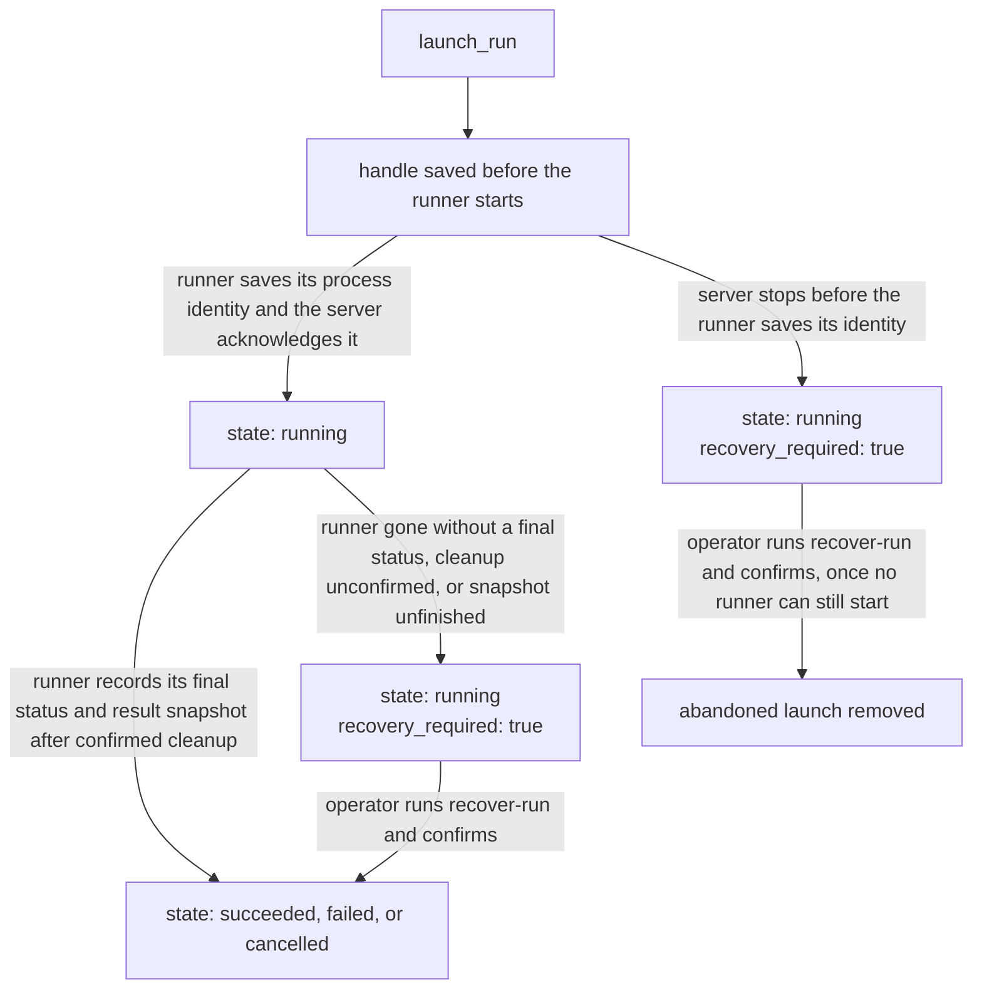

# MCP operator guide

The optional PhaseSweep MCP server exposes only experiments an operator has
listed in a reviewed catalog. It launches detached local processes and stores
durable run IDs, so a client disconnect or server restart does not end an
approved run. PhaseSweep owns the server and catalog; each MCP client owns its
own connection configuration and instructions. See [MCP setup](mcp_setup.md)
for installation and client-owned configuration.

The server runs over local stdio and is supported on Linux. It needs readable
`/proc` process start times to distinguish process reuse during cancellation
and recovery.

## The catalog

The catalog maps opaque agent-visible IDs to operator-owned experiment YAML
paths. Paths, commands, environments, storage URLs, and raw logs never appear
in normal tool responses.

```yaml
state_dir: /absolute/path/to/phasesweep-mcp-state
max_concurrent_runs: 1
experiments:
  - id: tiny_lm
    config: /absolute/path/to/mcp_experiment.yaml
    cwd: /absolute/path/to/trainer-checkout
    description: Approved small local language-model sweep.
    allow:
      launch: false
      cancel: false
      from_phase: false
    visible_params: none
```

`id` is the safe catalog identifier an agent may name. `config` and `cwd` are
operator-only paths. `visible_params` is `none`, `all`, or a list of sampled
parameter keys. Keep it at `none` unless exposing those values is intended.
Side effects are opt-in: `allow.launch`, `allow.cancel`, and
`allow.from_phase` default to false.

MCP experiments must use a persistent local SQLite, Journal, or `auto`
ledger, an absolute `workdir`, and an absolute storage path after `auto` is
resolved. Set an absolute `execution.cwd` when it is present. In-memory and
external-database storage are not durable detached-run targets.

Follow [MCP setup](mcp_setup.md) to create, review, and validate a catalog.
To run the stdio server directly:

```bash
phasesweep mcp serve --catalog /absolute/path/to/catalog.yaml
```

## Fresh MCP state

`state_dir` is private, owner-only state for handles, logs, audit entries, and
frozen terminal snapshots. This release adds a format marker at its root, and
the server refuses an unmarked, malformed, or unsupported durable state
directory before creating or repairing it.

> [!IMPORTANT]
> Use a fresh state directory for the consolidated release. Do not point this
> release at old MCP state and do not try to migrate, adopt, or repair it. Use
> the preserved PhaseSweep 0.3.1 environment to inspect or recover existing
> 0.3.1 state.

## Tool workflow

Catalog operations use an experiment ID:

1. `list_experiments` discovers the reviewed catalog, using its cursor until
   there are no more pages.
2. `inspect_experiment(experiment_id)` returns an approved experiment's phase
   shape, metric descriptor, and permissions. It never launches work.
3. After explicit user authorization, `launch_run(experiment_id, from_phase?)`
   starts the detached run and returns its durable `run_id`.
4. `get_latest_run(experiment_id)` is the reconnection lookup when a client
   lost a run ID. It returns the newest handle for that catalog experiment, or
   `found: false` when no matching run exists.

Run lifecycle reads use a run ID only:

```text
get_run_status(run_id)
await_run(run_id, timeout_seconds)
get_run_results(run_id)
cancel_run(run_id)
```

Save the `run_id` returned by launch. To reconnect from another chat or after a
client restart, call `get_latest_run(experiment_id)`, then use that returned
`run_id` for status and results. If it returns `found: false`, there is no run
to resume. `await_run` is bounded server-side waiting; use it for monitoring
rather than tight status polling. Never cancel a run or launch a replacement
automatically.

`get_run_results` is run-specific; terminal reads use that run's frozen result
snapshot. A plain `phasesweep run` can publish winners, but it does not create
an MCP run record. Its results remain inspectable through `phasesweep status`
and `phasesweep show-winners`; the server does not create handles for an
arbitrary existing output tree.

## Reading status responses

Run status and results are path-free, strict structured payloads. They expose
the run state, phase counts, winner presence, metric semantics, and only the
sampled winner parameters allowed by `visible_params`. Composed fixed and
inherited overrides are not returned.

For a terminal run, results come from the terminal snapshot captured for that
run, not from a later mutable study. This keeps a run's observed outcome stable
after another launch, a catalog edit, or a new publication. A terminal snapshot
that is absent or unreadable remains unavailable; it is not reconstructed from
the current ledger. Availability fields may be unknown when an observation was
not possible and must not be treated as available.

`publication_integrity` reports whether the experiment's recorded publication
still validates:

| Value | Meaning |
| --- | --- |
| `ok` | The recorded publication validates. |
| `absent` | No result has published yet. |
| `failed` | A publication was recorded but no longer validates; it needs operator inspection. |
| `permission_denied` | The server process cannot read the publishing tree. |
| `unknown` | The run's terminal snapshot cannot establish an answer. |

For `failed`, `permission_denied`, and `unknown`, stop automated follow-up and
report the condition.

`recovery_required: true` means cleanup, launch handoff, or snapshot
finalization needs operator recovery. Agents should stop rather than guessing
at process or result state; [run state and recovery](#run-state-and-recovery)
shows where each case comes from.

Winner results describe selected values, not convergence curves, robustness,
causality, or unreturned trial history. Treat `<redacted>` values as deliberate
catalog policy, not missing data.

The operator may configure W&B, ordinary JSON, log, or envelope scoring.
Frozen result reads preserve the producing reader's assurance fields and need
no W&B SDK, credentials, or remote access. W&B binds its source to the managed
attempt ID; it does not assert the envelope's evaluation metadata or input
content guarantees. The trainer owns evaluation and aggregation; the metric
goal ranks the selected trial scalars. Log reduction defaults to `last` and is
independent of the ranking goal.

## Run state and recovery

Each run has a UUID-bearing handle under `state_dir/runs/`, plus private log,
saved-config, terminal-status, and recovery sidecar files under
`state_dir/logs/`. The control-process log is separate from trainer
`stdout.log` and `stderr.log`, which are inside the operator-owned experiment
workdir.

The server records a process identity and coordinates launch across servers
sharing one state directory. It retains an uncertain-cleanup reservation when
it cannot prove a detached process group has stopped. Cancellation uses the
saved identity and can require confirmation of cleanup; a stale PID alone is
never considered authority to signal another process.

A run's reported `state` and `recovery_required` follow that durable evidence.
Within one host boot, a run moves like this:



In both `recovery_required` cases the run still counts as running, so it keeps
its concurrency slot and blocks another launch of the same experiment until
`recover-run` settles it. A host reboot is the exception for a runner that died
without a final status: its recorded boot proves nothing from that boot
survived, so the run reads as `failed` without any signal being sent.

Operator recovery is deliberately a CLI operation, not an agent tool:

```bash
phasesweep mcp recover-run --state-dir /absolute/path/to/phasesweep-mcp-state --run-id <run-id>
```

Without `--confirm`, the command only inspects the run and reports the actions
it would take. Read that report, then repeat the command with `--confirm` to
perform them.

> [!WARNING]
> Do not delete run-handle files individually: a run history consists of its
> handle and matching log/status/config sidecars. Archive that complete set only
> between campaigns after the run is terminal and no recovery is required.

## Security boundary

The server does not accept configuration YAML, paths, commands, storage URLs,
environment values, search ranges, sampler settings, gates, or safety waivers
as tool input. Only the operator-authored catalog maps an experiment ID to a
config. A catalog permission is not a grant to alter its config.

No tool returns raw trainer logs, result files, commands, storage locations,
or unredacted fixed/inherited values. Keep secrets, private paths, and data
identifiers out of searchable categorical choices unless exposing them is an
intentional catalog decision.

> [!NOTE]
> Training still runs with the authority of the operator-authored command; MCP
> restricts agent inputs and outputs, not the trainer process itself.

Clients that support resources can read `phasesweep://catalog` for the first
catalog page. The packaged `phasesweep_run_and_monitor` prompt supplies the
same run-safety guidance as [the installed agent instructions](../src/phasesweep/mcp/agent_prompt.md).
