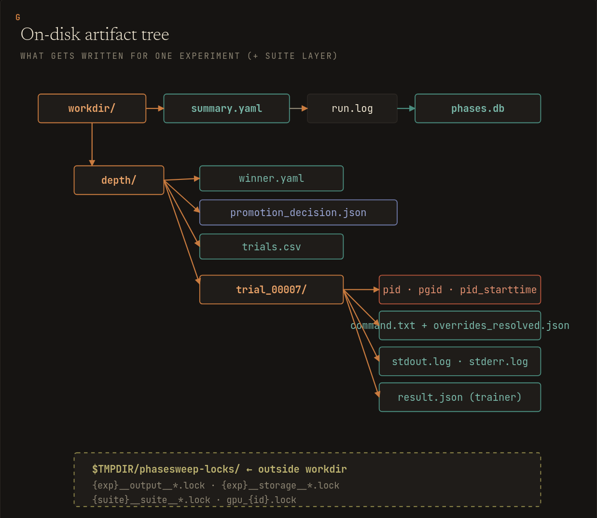
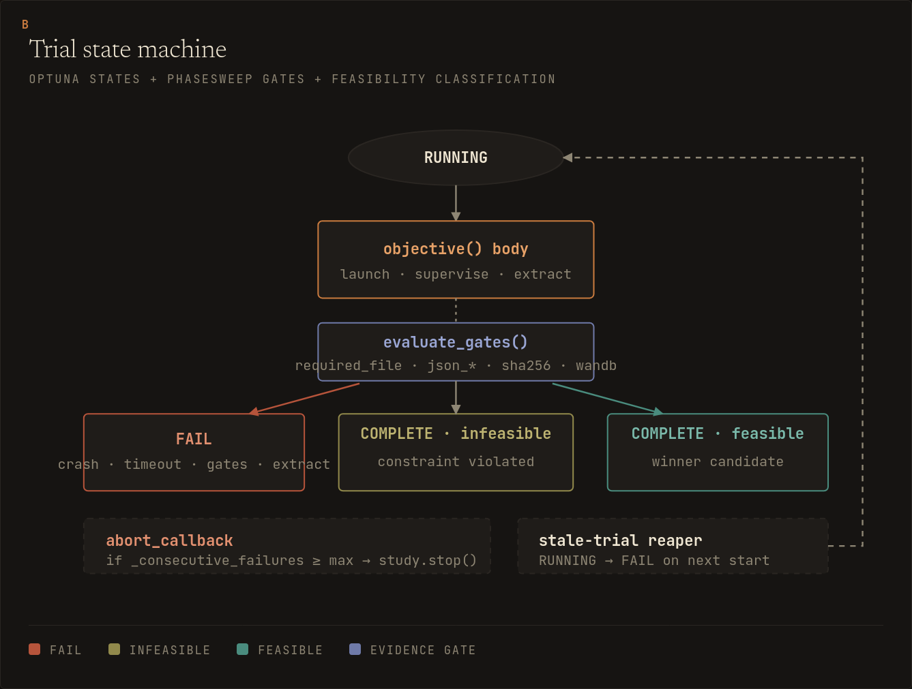
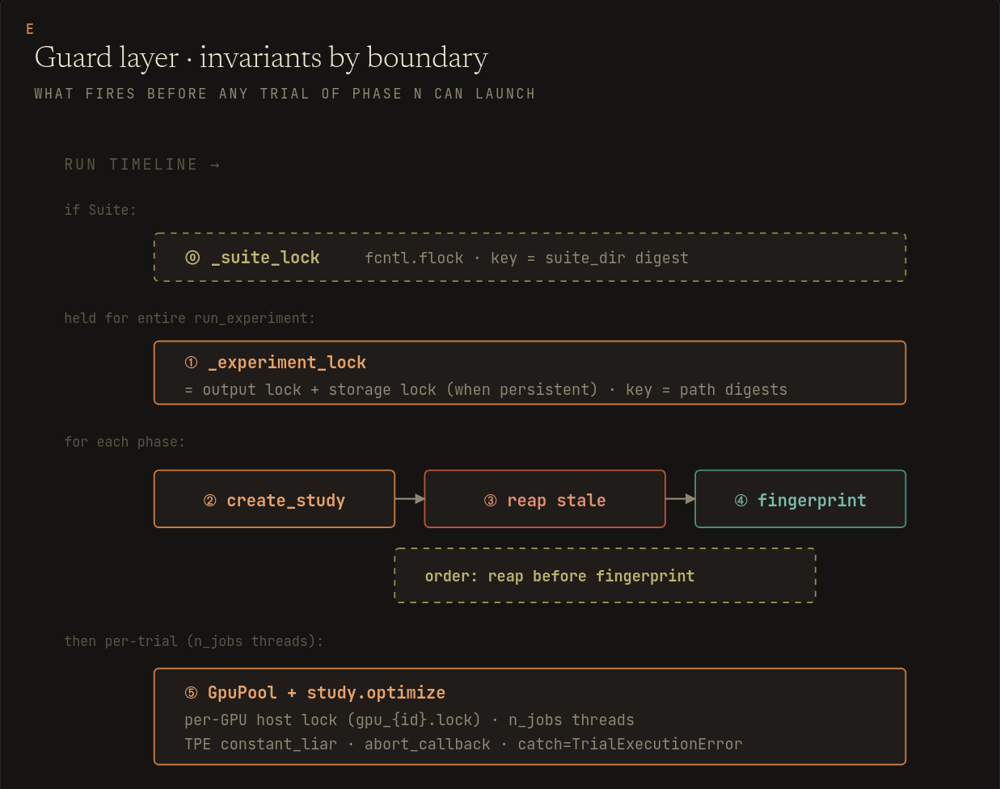

# Runtime behavior

## Platform support

Non-dry-run execution requires a POSIX platform such as Linux or macOS. phasesweep uses POSIX process groups for subprocess cleanup and `fcntl.flock` for same-host locks. Config validation and `--dry-run` do not launch subprocesses and do not take those locks, but real runs fail early on unsupported platforms.

## Output layout

A completed run writes one namespace per experiment:

```text
runs/
  tiny_lm_16mb/
    depth/
      trial_00000/
        command.txt
        overrides_resolved.json
        result.json
        stdout.log
        stderr.log
      trials.csv
      winner.yaml
    lr/
    regularization/
    run.log
    summary.yaml
  phases.db
```

`pid` and `pgid` are written atomically while a trial is live. On Linux, phasesweep also writes `/proc` start time to `pid_starttime` when it is readable. Identity files are removed on clean exit and preserved on failure for inspection. If an identity write fails after launch, phasesweep terminates the new process group before returning a failed trial result.



## Process management



Every trial runs in a new process group via `start_new_session=True`. Timeouts and shutdown signals target the whole group, so descendants such as launcher workers or dataloader processes are cleaned up with the root process.

`timeout_seconds_per_trial` is the normal per-trial subprocess cap. `timeout_seconds_per_phase` bounds each Optuna optimize invocation, including a later top-up, while top-level `timeout_seconds_per_run` bounds the current whole-experiment invocation. phasesweep passes the remaining budget into GPU lease acquisition and active trial supervision, so the deadline stops new work and begins process-group termination; the SIGTERM/SIGKILL cleanup grace can finish after that deadline. When a phase or run deadline stops the phase before the requested number of terminal trial attempts exists, phasesweep refuses to select a partial winner unless the phase sets `allow_incomplete_on_timeout: true`.

If a wallclock timeout and `max_consecutive_failures` become true in the same phase, timeout handling takes precedence. A phase that has at least one completed feasible trial can therefore persist a timeout-marked partial winner when `allow_incomplete_on_timeout: true`, instead of having that winner masked by the consecutive-failure abort path. Without that opt-in, the same situation fails closed with `TimeoutError`.

SIGTERM, SIGINT, and SIGHUP trigger shutdown cleanup. The handler sends SIGTERM to active groups, waits briefly, sends SIGKILL to survivors, and exits with `128 + signum`. SIGKILL and hard OOM kills cannot be caught by Python.

Launch uses signal deferral around the `Popen()` to registry window. A shutdown signal cannot land between process creation and registration and leave the child unsignalled.

If cleanup cannot prove the process group is gone, phasesweep fails closed with `UnsafeProcessCleanupError`. Under parallel Optuna execution, the orchestrator records a hard abort so no queued worker can reuse the released GPU lease before the error surfaces.

## Stale trial reaping

On startup and before skipped phases in `--from-phase`, phasesweep reaps Optuna trials stuck in `RUNNING`:

1. Read the persisted `phasesweep_trial_dir` user attribute, or fall back to the canonical trial directory when a crash left a pre-launch `RUNNING` trial before that attribute was written.
2. On Linux, match PID plus process start time to avoid PID-reuse kills. When `/proc` start time is unavailable, use the live PID as a best-effort identity check.
3. Fall back to PGID cleanup when the root PID is gone but descendants remain.
4. Mark the trial `FAIL` only after cleanup is confirmed.

Reaping runs before fingerprint checks, so a config mismatch cannot leave old GPU-holding processes alive.

## Concurrency model

phasesweep supports one orchestrator per experiment on one host. Inside one orchestrator, `n_jobs > 1` parallelizes trials in a phase.

A run always takes same-host `flock`s under `PHASESWEEP_LOCK_DIR` when set, otherwise `/var/tmp/phasesweep-locks/`:

- Output lock: resolved `<workdir>/<experiment>/` path.
- Storage lock: canonical Optuna storage identity plus experiment name when storage is persistent.



SQLite identities fold SQLAlchemy dialects, so `sqlite:///x.db` and `sqlite+pysqlite:///x.db` collide. File-backed storage lock identities ignore URL query options, so `sqlite:///x.db?timeout=30` and `sqlite:///x.db` share a lock. Locks are taken in deterministic path order and a second process fails fast instead of corrupting output or storage.

The lock directory must resolve to one path shared by every cooperating phasesweep process on the host. Schedulers that set a per-job `TMPDIR`, containers with private `/tmp`, and systemd `PrivateTmp` units should set `PHASESWEEP_LOCK_DIR` to a host-shared path such as `/var/tmp/phasesweep-locks` or a site-managed node-local equivalent.

Upgrade note: older phasesweep builds used the process temp directory for these locks. Existing stale locks under `/tmp` or a scheduler-provided `TMPDIR` are not consulted after the default moves to `/var/tmp/phasesweep-locks`; set `PHASESWEEP_LOCK_DIR` explicitly during a staged upgrade if you need old and new processes to coordinate.

CUDA device tokens also take per-device host locks. With the default `gpu_policy: single_per_trial`, explicit `gpu_ids`, explicit `gpu_devices`, ambient `CUDA_VISIBLE_DEVICES` tokens, and auto-detected `nvidia-smi` numeric devices are leased even for `n_jobs == 1`, preventing independent local phasesweep runs from double-booking the same GPU. `gpu_policy: whole_node` requires `n_jobs: 1`, leases every configured or detected token, and exposes the comma-joined set to the trainer for local DDP/FSDP/DeepSpeed-style launches. `gpu_policy: none` never changes `CUDA_VISIBLE_DEVICES` and never acquires GPU locks; parallel use requires `allow_no_gpu_isolation: true` because isolation is delegated to the operator or an external scheduler. Numeric tokens keep numeric lock names; opaque UUID/MIG tokens use sanitized, hashed lock names. When a GPU is assigned, the child environment defaults `CUDA_DEVICE_ORDER=PCI_BUS_ID` unless the operator explicitly set another order.

> [!WARNING]
> Multi-host writers against one shared study are unsupported. The startup reaper owns all visible `RUNNING` trials, so two hosts could fail each other's live work. Safe multi-host orchestration would need per-trial leases, heartbeats, and host-aware stale-trial reaping.

## Fingerprints and resume

Each phase study stores a semantic fingerprint. Phase run-control fields are excluded: `n_trials`, `n_jobs`, `gpu_ids`, `gpu_devices`, `max_consecutive_failures`, `allow_no_gpu_isolation`, `allow_unbounded_trials`, `timeout_seconds_per_phase`, `allow_incomplete_on_timeout`, `allow_partial_grid`, `allow_seed_search`, and `comment`. Top-level experiment name, storage, workdir, and `timeout_seconds_per_run` are also outside the fingerprint; experiment name and storage select the study identity instead.

The payload includes the phasesweep package version; trial command; [override format](config.md#override-formats); environment; metric and constraints; contracts applied by the phase; every remaining phase field, including its name and inheritance declaration; and each inherited winner's effective overrides.

With persistent storage, re-running the same YAML reuses a study and tops it up when the fingerprint matches. `--from-phase <name>` skips earlier phases by loading their `winner.yaml` files after stale reaping and fingerprint verification, even when storage is in-memory. Promotion is applied before `winner.yaml` is written, so `continue_baseline` resumes from the exposed baseline winner. A persisted incomplete timeout winner only loads when the current skipped phase still sets `allow_incomplete_on_timeout: true`.

`--dry-run` renders one example command per phase without launching subprocesses, writing preview files, creating run directories, touching storage, or taking the run lock.
