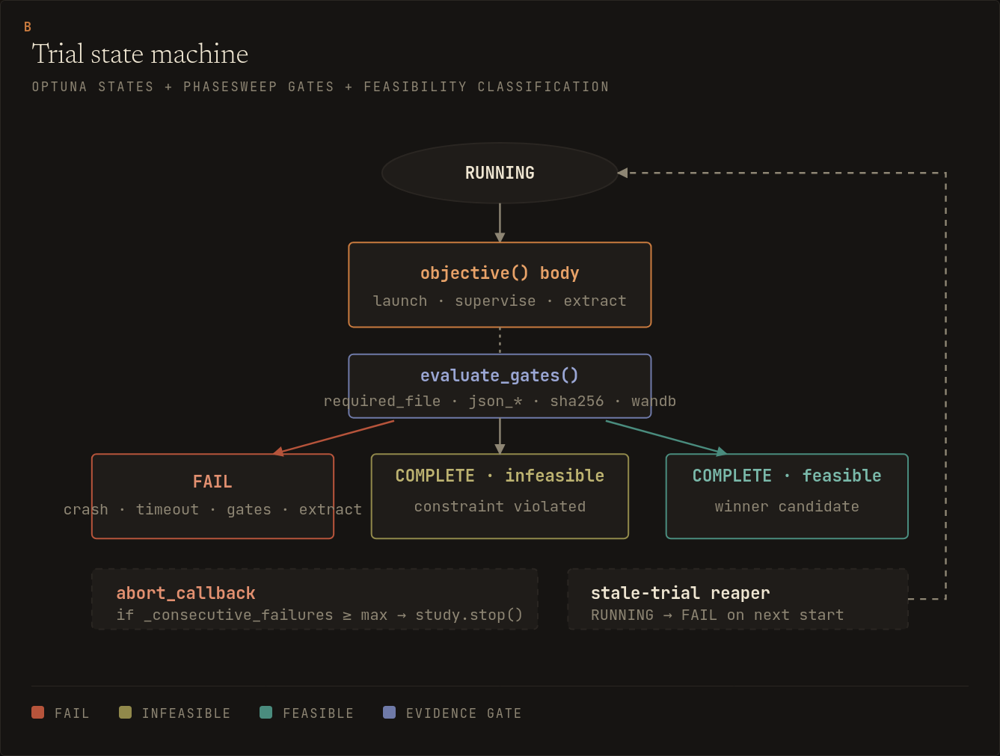
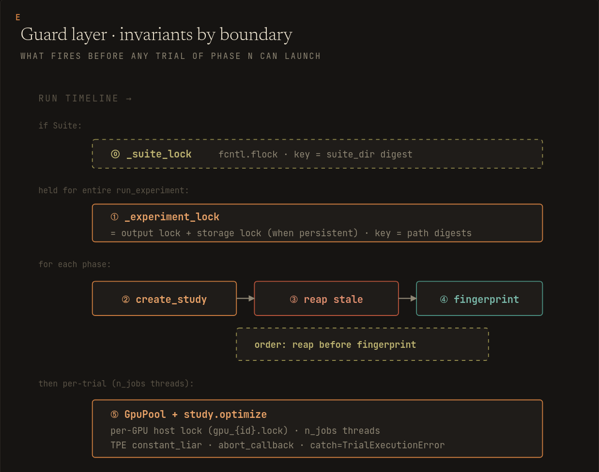

# Runtime behavior

## Platform support

Non-dry-run execution requires a POSIX platform such as Linux or macOS. PhaseSweep uses POSIX process groups for subprocess cleanup and `fcntl.flock` for same-host locks. Config validation and `--dry-run` do not launch subprocesses and do not take those locks, but real runs fail early on unsupported platforms.

MCP operations that validate a catalog, start the server, install an MCP client entry, or recover a run require Linux with readable `/proc` process start times. This makes autonomous cancellation and crash recovery PID-reuse-safe. Instruction-only client installation does not load a catalog and remains available without the MCP runtime. The core CLI remains available on supported POSIX platforms.

## Output layout

The bundled [toy experiment](../examples/experiment.yaml) writes one namespace per experiment:

```text
runs/
  tiny_lm_16mb/
    depth/
      trial_00000__generation_<generation-id>__attempt_<attempt-id>/
        attempt_lifecycle.json
        command.txt
        overrides_resolved.json
        process_identity.json
        result.json
        stdout.log
        stderr.log
      trials.csv
      winner.yaml
    lr/
    regularization/
    generations/
      <generation-id>/
        config.snapshot.yaml
        generation.yaml
        reproducibility.json
        summary.yaml
        phases/<phase>/winner.yaml
        phases/<phase>/promotion.yaml
    generation.yaml
    last_successful_generation.yaml
    run.log
    summary.yaml
    attempts/
      <attempt-id>.json
  phases.db
```

Every non-dry experiment invocation mints a generation ID, and every subprocess launch mints an attempt ID. Both are stored in Optuna before launch and included in the trial directory name, so a repeated in-memory study cannot read files left by an older trial with the same number. A generation namespace is claimed exactly once under the experiment lock; a reused caller-supplied ID is rejected before any lifecycle or trial state changes. Each generation keeps its lifecycle record, summary, winners, and promotion decisions under `generations/<generation-id>/`. Claiming a generation also freezes the configuration behind it, before any lifecycle state exists, so a generation that later fails preflight, execution, or publication still says what ran. `config.snapshot.yaml` is that configuration: the canonical full config as PhaseSweep parsed it - normalized key order, materialized defaults, no comments - not a copy of the operator's file, and the only place search spaces, fixed overrides, contracts, `env`, and the trial command survive an edited or deleted YAML. Because `env` may hold secrets it is written owner-only (`0600`) even though its directory is not; a reader who cannot read it cannot validate the publication, which fails closed like any other unreadable artifact. That fail-closed verdict is reported as a permission denial naming the publishing user, not as corruption, so a second operator reading a healthy tree is told to re-read it as the owner rather than to inspect or restore a namespace that is intact. `reproducibility.json` is its shareable counterpart, an ordinary umask-governed artifact (0644 under the usual 0022 umask) carrying the PhaseSweep version, the schema versions in force, whether the generation's id was minted by the engine or granted by the caller (a detached [MCP run](mcp.md) uses its run id, and this record is what keeps that launcher-granted authority detectable after the launcher's own state directory is lost), the experiment config fingerprint and one digest per phase's configured semantics, the operator-declared [provenance](config.md#experiment-keys) mapping, and the SHA-256 of the snapshot's bytes. It is digests, never values: no `env` values, no ambient values, and nothing from the snapshot's contents beyond that digest - reproducing a published winner means reading the snapshot, not the record. `generation.yaml` is the mutable current-generation pointer: it moves through `preflighting` -> `running` -> a terminal state (`published`, `publication_failed`, or `failed`) on every invocation, with no monotonic guard across invocations. `last_successful_generation.yaml` is the single authoritative publication pointer; it advances only after the generation's own immutable summary - a versioned result manifest (`schema_version: 2`) listing every winner and promotion artifact plus `config.snapshot.yaml` and `reproducibility.json` with their content hashes, alongside the metric semantics, phase plan, and config fingerprint that give those numbers meaning - validates end to end: every listed artifact must exist, hash to its recorded content, parse, and cross-check against the summary's own winner facts and identity, and the namespace may hold nothing the manifest does not list. Editing or deleting either provenance file after publication therefore invalidates the publication exactly like tampering with a winner. Generations published before those two files existed list neither and hold neither, which satisfies the same listed-if-and-only-if-present rule and keeps them fully valid. Reads revalidate the same manifest before every pointer-backed access; they never depend on the per-generation lifecycle record. Failing that revalidation is never reported as "nothing published": path-construction and resume callers still fail closed, but every surface that *reports* publication state distinguishes a pointer that was never written from one whose target no longer validates (see [inspection commands](#inspection-commands)). That record is a write-once terminal diagnostic when persistence succeeds: `failed` and `publication_failed` records are attempted on their failure paths, while a `published` record is attempted after the last-success pointer commits and may be absent without invalidating publication. Revalidation is intentional even though PhaseSweep writes generation namespaces once: filesystem permissions do not make them immutable, and long-lived CLI or MCP readers must notice later corruption or operator edits. The pointer commit itself is one-way: the whole publication transaction runs with shutdown signals absorbed, so a SIGTERM/SIGINT racing the commit deterministically loses - the committed publication stands, the run reports success, and the shutdown is honored at the next checkpoint (the next study in a suite, the next trial launch, or the MCP runner's terminal status write) before any new work starts. Published-result reads use the recorded semantics: winner reads extract the value under the metric name the winner file itself recorded, and `show-winners` prints the saved phase plan and comments - labeling the result historical when the current config has drifted instead of decorating old evidence with new annotations. The phase-level winners and root summary are compatibility projections of that last successful generation; a failed preflight or late-phase fingerprint check leaves them untouched. Resume loads both skipped winners and their promotion decisions from the immutable last-success generation, never from mutable compatibility projections. Winner entries retain the generation and attempt that produced their evidence, which can be older when a top-up reselects an existing trial or `--from-phase` reuses a validated parent winner.

Each winner selected from a real trial also freezes its objective evidence provenance - in `winner.yaml` under `objective_provenance` and in the winning trial's study attributes at extraction time. The record carries the extractor kind and the SHA-256 of its exact configuration, the evidence identity - a whole-file digest for `json_envelope` or `log_regex` sources (plus the envelope's validated evaluation metadata, or the log line that supplied the selected value and how many matches were examined), or the frozen W&B summary subset with the terminal run state and retrieval timestamp - and when the evidence was captured. Local result files and remote summaries can change after selection; the frozen record is what proves which exact source bytes or summary fields justified the published scalar. Winners persisted before this record simply lack the field. The frozen record covers the objective only: constraint values and gate results are persisted as observed values (`constraints:` and `gates:` in the winner file) without a digest of the bytes that produced them, so re-verifying *those* after the fact means re-reading the trial directory. W&B extractors have one further ambient input the record does not pin - the API endpoint itself (`WANDB_BASE_URL` and credentials come from the orchestrator's environment, outside both the config fingerprint and the `inherit_env` contract, which bounds only the trainer); keep one W&B deployment per experiment, or the same `entity/project` on two servers would read as the same source.

Every trial also records the identity of the environment its trainer ran under: the SHA-256 digest of the composed trainer environment (the `inherit_env` selection with `env` applied on top, canonicalized as sorted name-value pairs) and the sorted list of variable names it contained, both written as study attributes at allocation so failed trials carry them too. The winner keeps the digest of the winning trial plus the `inherit_env` contract in `winner.yaml` (`trainer_env_digest`, `trainer_inherit_env`); names stay trial-level. Ambient *values* are never stored anywhere by default - they hold tokens and credentials - so the digest is what tells two otherwise identical runs apart, and the names say which variables were in play. `execution.record_env: true` opts into a raw `environment.json` in each trial directory holding the digest, the contract, and every name-value pair; that file is the one exception to the trust boundary below, created owner-only (0600) like the lock namespace even though its directory is not. The digest joins no fingerprint by design - an environment change must never invalidate a study or block a top-up - so divergence is reported rather than enforced: selection warns when the compared trials of one phase span more than one digest, `--from-phase` warns when an inherited winner's digest differs from the current process's, and preflight warns once when `inherit_env: all` meets persistent storage. Winners and trials recorded before these fields exist simply lack them.

Published suite results get the same anchoring as experiment generations: each study record in a suite summary (`schema_version: 3`) carries the path and content hash of the component generation summary it derives from, and every exposed winner must match - by phase, trial number, metric value, and generation/attempt identity - a winner in one of those hash-verified component summaries (promotion-adopted winners match the baseline's). The check runs before the suite last-success pointer commits and again before any read trusts it, so an edited suite summary or component artifact is never read as a published number - and, like the experiment pointer, is reported as a corrupt publication rather than as a suite that never published. Suite summaries published before v3 keep the identity-only gate.

Each trainer starts behind a supervisor ready/ack handshake with an explicit launch boundary. Before the barrier, PhaseSweep launches a fully self-contained, stdlib-only helper script directly (never `-m phasesweep.runtime.supervisor`, which would import the whole package) under `python -I -S`, with a minimal sanitized environment - just `PATH` - instead of the trainer's environment. `-S` skips site initialization (no `sitecustomize`/`usercustomize`); `-I` implies `-P` on Python >= 3.11, so the script's own directory is never added to `sys.path`. This keeps anything the trainer's composed environment (`PYTHONPATH`, a shadowed package, `experiment.env`) could poison or shadow from executing before identity is durable, and avoids paying PhaseSweep's package-import cost on every trial. The helper signals readiness, then blocks reading a length-prefixed JSON payload from the acknowledgement pipe. Only after PhaseSweep atomically writes and fsyncs `process_identity.json` with the attempt ID, PID, PGID, Linux process start time, and host boot ID does it send that payload - the trainer's shell command and full trainer environment - over the pipe; the helper then `execve`s `/bin/sh -c <cmd>` under the trainer environment, replacing itself as the same PID/process group already registered by the orchestrator. If the orchestrator dies before sending the payload, pipe EOF makes the helper exit without starting training. The identity record is always retained; the trial directory additionally carries an `attempt_lifecycle.json` record written as `allocated` before attempt identity attributes are persisted and before any process is launched, then updated to `exited` (return code plus cleanup confirmation) once the process group's termination is confirmed. Recovery can therefore tell a cleanly finished trainer, a never-launched allocation, and a genuinely uncertain crash apart instead of failing closed on all three. If identity persistence or payload delivery fails, PhaseSweep terminates the blocked supervisor group before returning a failed trial result. The helper also resets its inherited signal mask before signaling readiness: the orchestrator spawns it from inside a shutdown-signal deferral window and the blocked mask survives both fork and exec, so without the reset every trainer would run with SIGTERM/SIGINT/SIGHUP blocked - unable to shut down gracefully, and always burning the full SIGTERM grace before SIGKILL landed.

`json_file` trials additionally receive `overrides.json`, and a phase with a promotion rule writes `promotion.yaml` when that rule is evaluated. Files such as `result.json` are trainer-owned evidence, not fixed PhaseSweep output.

Trust boundary: `workdir` is operator-trusted. Engine-owned files inside it - including trial artifacts, `process_identity.json`, `attempt_lifecycle.json`, and the experiment-level attempt registry - use ordinary path handling and are not symlink-hardened; records that require crash-safe replacement are still written atomically. The directory is not required to be owner-only, since operators and tooling need ordinary access to logs, evidence, and resolved overrides. Two files inside it are hardened because they carry configured or ambient values verbatim: the opt-in `environment.json` in a trial directory, and every generation's `config.snapshot.yaml`. Both are written owner-only (0600) through the private atomic writer while their directories keep ordinary permissions, and PhaseSweep refuses to replace either if the existing file is not already a private, unshared regular file. Validated, `O_NOFOLLOW` handling is otherwise reserved for the runtime lock namespace and MCP `state_dir`, which live outside the experiment artifact tree.

## Process management



Every trial runs in a new process group via `start_new_session=True`. Timeouts and shutdown signals target the whole group, so descendants such as launcher workers or dataloader processes are cleaned up with the root process.

That guarantee is process-group-scoped, not descendant-scoped. A trainer - or anything it launches - that calls `setsid()` (the standard daemonization technique used by some launchers) leaves the supervised process group, and PhaseSweep's timeout, shutdown, and stale-reaping signals never reach it; cleanup can be reported confirmed while such a daemon still holds GPU memory or file handles. The trainer contract is therefore: do not daemonize out of the trial's process group, and treat anything that must outlive the trial as out of PhaseSweep's ownership. Containing deliberate escapees would require cgroup v2, a transient systemd scope, or subreaper-based descendant tracking, none of which PhaseSweep currently provides.

`timeout_seconds_per_trial` is the normal per-trial subprocess cap. `timeout_seconds_per_phase` bounds each Optuna optimize invocation, including a later top-up, while top-level `timeout_seconds_per_run` bounds the current single-experiment invocation or one compiled study in a suite. A suite starts a fresh run budget for each study. PhaseSweep passes the remaining budget into GPU lease acquisition and the entire supervised launch: the supervisor readiness wait is capped to the remaining budget, the deadline is re-checked after identity persistence and before the trainer payload is delivered - an expired budget aborts the blocked supervisor and reports a timeout without ever starting the trainer - and the final process wait uses the recomputed remainder, so launch overhead consumes the budget instead of silently extending it. The deadline stops new work and begins process-group termination; the SIGTERM/SIGKILL cleanup grace can finish after that deadline. A phase whose deadline (rather than its trainer) prevented any feasible trial reports `TimeoutError`, not a trainer failure. When a phase or run deadline stops the phase before the requested number of terminal trial attempts exists, PhaseSweep refuses to select a partial winner unless the phase sets `allow_incomplete_on_timeout: true`.

If a wallclock timeout and `max_consecutive_failures` become true in the same phase, timeout handling takes precedence. A phase that has at least one completed feasible trial can therefore persist a timeout-marked partial winner when `allow_incomplete_on_timeout: true`, instead of having that winner masked by the consecutive-failure abort path. Without that opt-in, the same situation fails closed with `TimeoutError`.

The consecutive-failure circuit breaker is reconstructed from an ordered outcome stored on every terminal trial. Its streak therefore continues across supported random/grid top-ups and process restarts, including failures produced when startup recovery safely reaps stale `RUNNING` trials. An abort cannot become a success just because the next invocation has no work left: the same `n_trials` target remains failed. Raising `n_trials` above the target accepted by the aborting invocation explicitly starts a new recovery streak for random/grid phases; TPE/CMA-ES continuation restrictions still apply. If writing the convenient study-level abort marker fails, the per-trial outcomes reconstruct the same decision on retry rather than silently publishing.

Expected trainer and evidence failures count toward that circuit breaker. An unexpected exception in PhaseSweep's objective implementation is instead phase-fatal: the first exception stops peer launches and is re-raised with its original type, message, and traceback after parallel workers drain. Its trial outcome and cause remain durable, so an identical retry cannot turn the mixed COMPLETE/FAIL study into a publication.

Metric extraction and evidence gates run after the trainer process and outside the GPU lease, but inside the phase/run wallclock budget: the configured timeouts bound the whole trial, not just the trainer. Enforcement is cooperative at stage boundaries - before the metric extractor, before each constraint extractor, before each gate, and before the result is accepted - so a single blocking local stage can overrun by at most its own duration. W&B extractors and gates additionally cap their polling budget to the remaining phase/run budget. A trial whose trainer succeeded but whose evidence could not be evaluated within the budget is a failed trial, and the phase reports a timeout rather than publishing a complete result. Timeout reporting is causal: PhaseSweep records whether a deadline blocked launch, capped and expired a subprocess or remote poll, failed a stage-boundary check, or stopped the scheduler short of its trial target. An unrelated trainer, extractor, or gate failure is not relabeled just because the clock happens to be past the deadline when it is observed. `allow_incomplete_on_timeout` applies only when a phase or run deadline leaves the phase short of its terminal-attempt budget; it does not turn an ordinary per-trial timeout into a selectable result.

SIGTERM, SIGINT, and SIGHUP trigger shutdown cleanup. The handler sends SIGTERM to every active trial group at once, waits one shared grace window, sends SIGKILL to the survivors, confirms each group is gone, and exits with `128 + signum`. The handler never waits on the direct child - a blocking `wait()` from a signal handler can deadlock against a concurrent wait in the main thread - so the bounded, unconditional direct-child reap that closes the poll-then-die zombie race runs on the normal (non-signal) cleanup paths instead. SIGKILL and hard OOM kills cannot be caught by Python.

Cleanup is bounded but not immediate. Trial groups that ignore SIGTERM cost the full 10-second grace plus roughly 2 seconds to confirm the SIGKILL; on the signal path both windows are shared across all active groups, so shutdown latency stays near 12 seconds regardless of `n_jobs`. Normal per-trial cleanup adds up to 5 more seconds for the bounded direct-child reap: about 17 seconds worst case. A shutdown signal that arrives while a trial launch is still in flight is deferred until that launch finishes its own cleanup. If a supervisor never becomes ready, the launch can first consume its 10-second readiness timeout and then the 17-second cleanup bound, so an interactive Ctrl-C can take about 27 seconds worst case to return the prompt. It is not a hang; sending a second Ctrl-C only risks leaving the group behind.

Shutdown-signal ownership follows an explicit contract, not handler-identity inference: a process-lifetime `install_signal_handlers()` call (the CLI and MCP entry points) owns SIGTERM/SIGINT/SIGHUP for the rest of the process, and every later `signal_handler_scope()` call - on any thread - is then a no-op. Absent that, the main thread may take temporary ownership for one call tree: the outermost `signal_handler_scope()` call installs the handlers and unblocks the signals, lexically nested calls on that same thread share the ownership and touch nothing, and the outermost call's exit restores the prior handlers and signal mask in a fixed order - block, then restore handlers, then restore the mask - so a shutdown signal pending at teardown cannot fire against a handler that is still mid-restoration. A `signal_handler_scope()` call from a thread that is neither the main thread nor covered by an existing owner raises `SignalOwnershipUnavailableError` instead of running unprotected. Calling `install_signal_handlers()` from inside an open scope is a handover, not a conflict: the scope sees the process-lifetime claim and leaves the handlers and mask installed on exit rather than restoring the host's, so the ownership the entry point just took is the ownership that survives.

Launch uses signal deferral around the `Popen()` to registry window. A shutdown signal cannot land between process creation and registration and leave the child unsignalled; uncatchable parent death before identity commit cannot start the trainer because the supervisor still awaits the launch payload.

If cleanup cannot prove the process group is gone, PhaseSweep fails closed with `UnsafeProcessCleanupError`. Under parallel Optuna execution, the orchestrator records a hard abort so no queued worker can reuse the released GPU lease before the error surfaces.

## Stale trial reaping

Before a new generation is published or any phase begins, PhaseSweep first scans the experiment-level `attempts/` registry independently of the current phase graph, then inspects every declared phase study that already exists. Each active-attempt entry binds the attempt ID to the phase, study, storage, trial number, and trial directory that produced it. The entry is retired after the Optuna trial becomes terminal, so a renamed or removed phase, or a changed storage URL, cannot hide an older live process from preflight recovery.

Registry writes are best-effort. A write failure is logged and loses cross-config discovery for that attempt, but the declared-phase scan still recovers it when the same phase graph and storage remain configured.

For every `RUNNING` trial reached through either path, PhaseSweep:

1. Read the persisted `phasesweep_trial_dir` user attribute, or fall back to the canonical trial directory when a crash left a pre-launch `RUNNING` trial before that attribute was written.
2. Require one complete atomic identity bound to the Optuna attempt. Missing, malformed, partial, or wrong-attempt identity leaves cleanup uncertain rather than proving absence.
3. On Linux, match boot ID plus PID and process start time to avoid PID- and reboot-reuse kills. A record from an earlier boot is safe to close without signalling because no process from that boot can remain. The boot ID identifies the host kernel, so restarting a container without rebooting its host is not treated as a reboot; PID and process start time still guard against reuse. When robust process-birth identity is unavailable, automatic stale signalling fails closed for operator recovery.
4. Fall back to the verified PGID when the root PID is gone but descendants remain.
5. Mark the trial `FAIL` only after cleanup is confirmed.

Missing studies are not created by either recovery read. Both passes run before fingerprint checks, so a config mismatch or a later-phase orphan cannot leave old GPU-holding processes alive while earlier work starts.

This recovery pass is deliberately not bounded by `timeout_seconds_per_run`: interrupting a stale-process kill to honor a clock would leave leaked GPU processes alive, so cleanup always finishes. It does run inside the invocation, before any phase starts, and each stale trial group that ignores SIGTERM costs the full escalation (about 12 seconds), serially. After an unclean shutdown of an `n_jobs > 1` phase, a tight run budget can therefore be consumed by recovery and expire before the first phase launches - the reaping is durable, so simply re-invoking (or raising the budget) proceeds normally.

## Concurrency model

PhaseSweep supports one orchestrator per experiment on one host. Inside one orchestrator, `n_jobs > 1` parallelizes trials in a phase.

A run always takes same-host `flock`s. By default they live in the owner-only per-user directory `~/.cache/phasesweep/locks`:

- Output lock: resolved `<workdir>/<experiment>/` path.
- Storage lock: canonical Optuna storage identity plus experiment name when storage is persistent.



SQLite identities fold SQLAlchemy dialects, so `sqlite:///x.db` and `sqlite+pysqlite:///x.db` collide. File-backed storage lock identities ignore URL query options, so `sqlite:///x.db?timeout=30` and `sqlite:///x.db` share a lock. RDB identities normalize the password, driver suffix, host case, an implicit default port, query order, and connection-only options (`application_name`, `connect_timeout`, `sslmode`, `keepalives*`, ...), so a rotated credential or a reordered query does not split the lock; identity-bearing options such as libpq's `host=/var/run/postgresql` are kept. What is *not* resolved: DNS aliases, load-balancer or pooler endpoints, service files, and `localhost` vs. `127.0.0.1` - a shared RDB reaches the same database under those spellings but gets a different lock, so keep the URL spelling consistent across configs that share one database. Locks are taken in deterministic path order and a second process fails fast instead of corrupting output or storage.

The private default coordinates every PhaseSweep process running as the same user. Cross-user coordination is opt-in: an administrator must provision an existing root-owned directory with the scheduler group, setgid and sticky bits, and mode `03770`, then set `PHASESWEEP_LOCK_DIR` for every cooperating process. PhaseSweep validates that directory and creates group-readable/writable `0660` lock files; it never creates or changes a shared namespace itself. An explicit owner-only `0700` directory is also accepted for custom per-user placement. Lock directory components and final lock files are opened without following symlinks, and existing files with unexpected ownership, links, or permissions are rejected before diagnostics are written.

Upgrade note: older PhaseSweep builds used `/var/tmp/phasesweep-locks`. Those files are not consulted by the private default; use a validated explicit `PHASESWEEP_LOCK_DIR` during a staged upgrade if old and new processes must coordinate.

The whole lock namespace is derived from the environment (`PHASESWEEP_LOCK_DIR`, else `$HOME`), so every orchestrator that must exclude the others has to resolve the *same* directory. An MCP server started under a launchd/systemd user unit or a confined client with a different `HOME` than the operator's shell splits every lock - experiment, storage, and GPU - between the two surfaces, and the two orchestrators will not see each other at all. When mixing launch surfaces on one host, set an explicit shared `PHASESWEEP_LOCK_DIR` for all of them.

CUDA device tokens also take per-device host locks. The policies are:

- `single_per_trial` (default): lease explicit `gpu_ids`, explicit `gpu_devices`, top-level `env.CUDA_VISIBLE_DEVICES`, ambient `CUDA_VISIBLE_DEVICES` tokens, or auto-detected `nvidia-smi` numeric devices, even for `n_jobs == 1`. Configured `env` takes precedence over ambient visibility, matching the trainer environment. This prevents independent local PhaseSweep runs from double-booking the same GPU.
- `whole_node`: require `n_jobs: 1` plus an explicit `gpu_ids` or `gpu_devices` list, lease every configured token, and expose the comma-joined set to the trainer for local DDP/FSDP/DeepSpeed-style launches. The set must be explicit because its size is the trainer's world size - a semantic input, not a throughput knob.
- `none`: never change `CUDA_VISIBLE_DEVICES` or acquire GPU locks. Parallel use requires `allow_no_gpu_isolation: true` because isolation is delegated to the operator or an external scheduler.

GPU locks key on canonical physical-device identity when PhaseSweep can resolve it. At pool construction PhaseSweep reads `nvidia-smi --query-gpu=index,uuid` and rewrites numeric indices and uniquely matched abbreviated `GPU-` UUIDs to the full UUID before deriving lock names. A run configured with `gpu_ids: [0]` and one configured with `gpu_devices: ["GPU-<uuid of 0>"]` (or inheriting that UUID through ambient `CUDA_VISIBLE_DEVICES`) then contend for the same lock file instead of both leasing the card. Only the lock identity is rewritten: the trainer still sees the token configured in `CUDA_VISIBLE_DEVICES`. Numeric fallback identities keep numeric lock names; UUID and MIG identities use sanitized, hashed lock names. Two tokens that resolve to one physical device are leased once. When a usable UUID map exists, a configured numeric index absent from it fails the run.

Canonicalization has three limits:

- If `nvidia-smi` provides no usable UUID map (missing binary, timeout, nonzero exit, or placeholder UUID fields), indices stay their own identity. One spelling convention used consistently on a host still collides with itself, but a device set that mixes numeric indices with opaque tokens fails closed because PhaseSweep cannot tell whether two forms name the same GPU. The probe must work or fail consistently for every orchestrator: an index-form fallback does not exclude a concurrent run's UUID-form lock for the same card. The fallback is logged. During auto-detection, the same failure on a host whose kernel driver lists GPUs is also logged because the phase then runs without CUDA binding or GPU locks.
- An abbreviated `GPU-` UUID is canonicalized only when the usable inventory contains exactly one matching full UUID. An ambiguous or unmatched prefix retains its own spelling as the lock identity and may not exclude a concurrent full-UUID lock for the same card. Use full UUIDs in `gpu_devices` and ambient `CUDA_VISIBLE_DEVICES` when lock identity must not depend on inventory resolution.
- A `MIG-...` token locks the MIG instance itself. PhaseSweep does not bind it to the parent GPU, so a run holding a MIG instance and one holding the whole parent device do not exclude each other.

Upgrade note: builds before UUID canonicalization locked numeric devices under `gpu_<index>.lock`; this build locks the same card under its UUID-derived name, so the two lock namespaces do not exclude each other. Running an old and a new PhaseSweep concurrently on one host can therefore double-book a GPU - the exact failure canonicalization prevents within one version. Upgrade every PhaseSweep installation on a host together; leftover `gpu_<index>.lock` files from old builds are inert and safe to delete.

When a GPU is assigned, the child environment defaults `CUDA_DEVICE_ORDER=PCI_BUS_ID` unless the operator explicitly set another order. That default is what keeps a numeric `CUDA_VISIBLE_DEVICES` token pointing at the card whose UUID the lock was taken on (`nvidia-smi` enumerates by PCI bus). Explicitly overriding the order (for example `FASTEST_FIRST`) while using numeric tokens decouples the locked card from the card the trainer actually occupies - use UUID tokens if you must override the ordering.

> [!WARNING]
> Multi-host writers against one shared study are unsupported. The stale-trial reaper owns all visible `RUNNING` trials, so two hosts could fail each other's live work. Safe multi-host orchestration would need per-trial leases, heartbeats, and host-aware stale-trial reaping.
>
> An `Experiment.storage` URL that resolves to any backend other than SQLite or Journal (an RDB URL such as `postgresql://...` or `mysql://...`) is rejected unless `allow_external_rdb_single_host: true` is also set. Set that acknowledgement only when every process that will ever touch the configured `storage` and `workdir` runs on a single host - e.g. using an RDB backend for durable storage or dashboard access from one PhaseSweep orchestrator, not for actual multi-host coordination.

## Fingerprints and resume

Each phase study stores a semantic fingerprint. Phase run-control fields are excluded: `n_trials`, `n_jobs`, `gpu_ids`, `gpu_devices`, `max_consecutive_failures`, `allow_no_gpu_isolation`, `allow_unbounded_trials`, `timeout_seconds_per_phase`, `allow_incomplete_on_timeout`, `allow_partial_grid`, `allow_seed_search`, and `comment`. One exception: under `gpu_policy: whole_node` the configured device-set *size* joins the fingerprint - it is the trainer's world size, so a 4-GPU and a 1-GPU evaluation of the same phase cannot share a study - while the tokens' spelling (indices vs UUIDs) remains run-control. Top-level experiment name, storage, workdir, and `timeout_seconds_per_run` are also outside the fingerprint; experiment name and storage select the study identity instead.

`workdir` is excluded so a result tree stays movable, but that mobility is explicit rather than implicit: each persistent phase study records the one resolved `<workdir>/<experiment>` artifact root it publishes into, under the study user attribute `phasesweep_artifact_root_v1`. The check runs at preflight under the experiment lock, before stale reaping and before any trial work, and covers every declared phase before any of them claims anything - so a refused multi-phase run leaves no study bound to the root it rejected. An absent binding is claimed on first contact only when the study holds no trials, mirroring the zero-trial fingerprint rebind; an equal binding proceeds; and a different binding is refused before any reaping, trial, or publication, so the bound tree is left exactly as it was. A study that holds trials but records no binding predates the attribute, and an ordinary run is refused rather than adopting it: which workdir owns those trials' evidence cannot be inferred, and guessing would let two trees each report an intact publication of the same study. Migrate it with `phasesweep rebind-workdir CONFIG` against a config whose `workdir` names its *original*, complete tree. Without any of this, running one config against a second `workdir` would match every fingerprint, top up or re-select against trial directories living under the first root, and publish a second, divergent result tree. In-memory studies never bind: nothing persists to conflict.

To relocate a tree, move it first and then run `phasesweep rebind-workdir CONFIG` against the config that already names the new location. It takes the same locks a run does and validates the destination before writing anything: the namespace must exist; every trial in the study ledger that persisted a trial directory must still have that directory under the destination, which is what rejects a stale copy taken before the ledger advanced; no trial may be `RUNNING` and no attempt registry entry may be unresolved, because stale-attempt recovery follows the absolute paths those attempts persisted and cannot follow them after a move; and, when the studies record completed trials, the destination's last-success pointer and generation manifest must validate there. Only then does it update the binding on every phase study and print each old root and new root. A suite that published a suite generation is refused outright - published suite summaries pin each study to the absolute path of the component summary it derives from - as is a suite whose every study completed a trial while the destination holds no suite pointer, since a lost pointer and a suite that never published are indistinguishable; component-level rebinds still work for a suite that never published one. It refuses, changing nothing, when every existing study is unbound and empty (an ordinary run binds those), when storage is in-memory, or when any destination check fails. Everything else in the durable state graph - trial directories, the attempt registry, suite summaries - still stores absolute paths, which is why the command refuses these cases instead of repairing them; see the tracked relocation TODO in [development](development.md). One operational note: a run refused for a workdir conflict has already claimed a generation under the new workdir, so that experiment directory exists and holds a failed generation record - remove it before moving the tree there, or the move nests the tree one level deep.

The same semantic exclusions govern a single experiment's published-config fingerprint. A suite fingerprint is stricter: it includes each fully compiled study plus study names, dependencies, and promotion rules. Changing a phase comment, trial target, or throughput setting therefore marks an existing suite result historical even when the component phase study remains reusable.

The payload starts with an explicit fingerprint-schema version and includes the trial command; operator-declared [provenance](config.md#experiment-keys); [override format](config.md#override-formats); environment; metric and constraints; contracts applied by the phase; every remaining phase field, including its name and inheritance declaration; and each inherited winner's effective overrides. The installed PhaseSweep version is recorded in each generation lifecycle record for diagnostics, but it is not semantic experiment identity.

With persistent storage, re-running the same YAML reuses a study and tops it up when the fingerprint matches. `--from-phase <name>` skips earlier phases by loading their `winner.yaml` files after stale reaping and fingerprint verification, even when storage is in-memory. Promotion is applied before `winner.yaml` is written, so `continue_baseline` resumes from the exposed baseline winner. A persisted incomplete timeout winner only loads when the current skipped phase still sets `allow_incomplete_on_timeout: true`.

Every top-up attaches the sampler declared by the phase rather than the Optuna default. Seeded random sampling derives each draw from the durable study name, trial number, and parameter name, so one uninterrupted invocation and arbitrarily batched top-ups produce the same parameter sequence. Grid sampling resumes from stored grid assignments; its deterministic traversal order is not the order of `choices` in the YAML, so trial numbers do not express preference. TPE and CMA-ES phases are restartable only before their first terminal trial or after reaching their accepted target. Optuna storage does not preserve process-local sampler state, so a fresh process would restart the seeded suggestion stream and could re-evaluate identical suggestions; PhaseSweep therefore rejects resuming an interrupted stateful phase mid-target, and likewise rejects raising `n_trials` for these samplers across invocations. Use a new experiment name (optionally with a stateless random/grid sampler), or run the full target in one uninterrupted invocation. This is not a runtime surprise: on persistent storage the config layer already requires an explicit `seed` for every stochastic sampler and `acknowledge_nonresumable: true` for `tpe`/`cmaes` (see [sampler capability on persistent storage](config.md#sampler-capability-on-persistent-storage)), and `phasesweep validate` and `phasesweep run --dry-run` print one capability line per phase — `phase 'lr': sampler=tpe seed=0 (non-resumable: run each target in one invocation)` — before any trial launches.

A random or grid phase can be topped up in place while it has no bound descendants. Each persistent study records its highest accepted terminal-trial target; lowering `n_trials` is rejected so a current config cannot relabel an over-target historical winner. Once a dependent phase study has been run, PhaseSweep rejects further top-ups of that reached ancestor before launching any trial: a new upstream winner would change the descendant's semantic fingerprint while its stored study name still identifies the old inherited context. Use a new experiment name for a larger upstream budget. `--from-phase` does not apply this restriction to skipped ancestors because they are not mutated.

Persistent studies also carry a PhaseSweep storage-schema version. An empty study can be initialized in place, but a populated study without the current schema is rejected before its rows count toward a trial budget. The error names the study and affected trial numbers; use a new experiment name or archive/delete the incompatible study rather than silently mixing unscoped historical trials. Upgrade note: storage schema 2 adds the ordered trial outcomes required to reconstruct failure policy safely. Populated schema-1 studies (and older unversioned studies) cannot be resumed or reused because their historical completion order is unknowable; archive them, use a new experiment name, and rerun the affected phases. The same new-name/archive rule still applies to `winner.yaml` files created before generation/attempt provenance.

## Validation and dry-run

`phasesweep validate` loads the config and checks schema, graph, sampler/search-space compatibility, override-key composition, and command-template placeholders. It does not check trainer or path existence, parser compatibility, storage connectivity, environment behavior, evidence production, GPU availability, or runtime promotion outcomes.

Every command reports failures through one process-level boundary with a fixed exit taxonomy. `2` is bad input: a usage error, or a config that cannot be loaded - a non-UTF-8 file, a YAML syntax error, a duplicate mapping key, or a schema violation. Config errors always name the file that failed, including the YAML scanner and parser errors PyYAML would otherwise label `in "<unicode string>"`. `1` is an expected operational failure - the run itself failed, for example no feasible trial, a busy experiment lock, or unconfirmed process-group cleanup. `70` is a PhaseSweep bug. `130` is an interrupt taken before the shutdown handlers ran; a shutdown signal handled during a run exits with `128 + signum` instead, as described under [Process management](#process-management). Only `70` prints a traceback, behind an explicit request to report it; the rest print a single `phasesweep: ...` line on stderr. `run -v` adds the traceback behind the `1` diagnostic without changing the exit code.

`phasesweep run --dry-run` additionally renders one valid sampled command per phase using fresh in-memory Optuna studies. The displayed sample becomes the hypothetical winner inherited by downstream preview commands, so one preview forms a coherent chain. Dry-run does not read persistent trial progress, create the referenced trial directories or `overrides.json`, display the final environment, launch subprocesses, extract evidence, evaluate gates or promotion, exercise suite dependencies, write files, touch configured storage, or take runtime locks.

## Inspection commands

For a single experiment, `phasesweep status CONFIG` reports read-only current-generation, published-generation, and represented-generation identity plus publication state, study trial counts, and phase state. For a suite, it reports the suite workdir, the suite's own published generation identity and publication state, and each compiled study's full experiment status, including component generation identities. Cross-process counts require persistent storage; a completed in-memory run has no study state for a later process to inspect.

`publication_integrity` says *why* `published_generation_id` is what it is, and is the one field with three values: `ok`, `absent`, or `failed`. `absent` means nothing has ever published here - the normal, healthy state of a fresh tree. `failed` means a last-success pointer exists but its target no longer validates, and a short `publication_error` appears beside it naming the validation failure. A `failed` payload reports exactly the facts a never-published tree does - null generation identities, no winner paths - because none of the unvalidated generation's contents may be presented as a result; the integrity fields are what distinguish the two. `phasesweep status` prints the whole payload and *then* exits non-zero on `failed`; `phasesweep show-winners` refuses outright rather than answering "no winner yet", which would read as a phase that has never run. Both print an explicit warning not to run anything over the tree first: generation namespaces are immutable, so the corrupt one is still on disk and can be inspected or restored, but a successful run publishes a new generation, advances the last-success pointer past the corrupt one, and stops reporting it anywhere. Running is deliberately *not* blocked - that is the operator's call to make knowingly - and a `--from-phase` resume raises the same validation error on its own when it loads winners. A suite carries the same three fields for its own last-success pointer (`publication_integrity` beside `published_suite_generation_id`), so `phasesweep status` escalates a suite publication that no longer validates even when every component study still does, and reports the same verdict `show-winners` resolves for that tree; a corrupt component publication still fails the suite read on its own. One case is not corruption: an unreadable owner-only `config.snapshot.yaml` reports `failed` with a permission-denied `publication_error` naming the publishing user, because a validation that cannot run must not report a publication as sound.

`phasesweep show-winners CONFIG` reads the authoritative last successful publication from the configured workdir. It remains useful after an in-memory run because publication artifacts are persisted even though the Optuna study is not. It applies the same three-state check to the suite last-success pointer, so a suite whose published summary or a recorded component artifact was edited reports corruption instead of "no successful suite result yet".

Both commands are read-only. `phasesweep rebind-workdir CONFIG` is the one non-run command that writes: it moves each phase study's artifact-root binding to the workdir the config now declares, after you have relocated the tree yourself (see [fingerprints and resume](#fingerprints-and-resume)).
