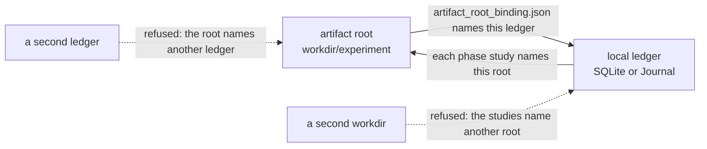

# Runtime behavior

PhaseSweep runs one ordered Experiment on a POSIX host. It uses same-host file
locks and process groups to serialize a persistent experiment and clean up
trainer subprocesses. GPUs are optional; the core CLI can run CPU-only work.
The optional MCP server additionally requires Linux `/proc` process identity
information for detached-run cancellation and recovery.

## Fresh-state cutover

This breaking release has one current on-disk format. Start it with all of the
following:

- a fresh artifact root (`<workdir>/<experiment>`), including for in-memory
  storage;
- a fresh local SQLite or Journal ledger, if the experiment is persistent; and
- a fresh MCP `state_dir`, if the experiment is launched through MCP.

The runtime checks an existing artifact root and local ledger before it creates
or stamps state. It refuses missing, malformed, or unsupported PhaseSweep
format records without modifying that namespace. An unmarked durable MCP state
directory is likewise refused before it is initialized.

> [!NOTE]
> A new experiment name or workdir does not make an old populated local ledger
> fresh: the format check covers every PhaseSweep study in the ledger, not only
> the current experiment's.

There is no migration, adoption, relocation, rebind, or repair path in this
release. Operate an existing 0.3.1 output, ledger, or MCP state directory with
the preserved 0.3.1 environment. Choose new paths for the consolidated
release.

## Output layout

For `workdir: ./runs` and `experiment: demo`, PhaseSweep writes under
`./runs/demo/`:

```text
demo/
  .gitignore
  artifact_root_binding.json
  run.log
  study.db                        # storage: auto with sequential phases
  generation.yaml
  last_successful_generation.yaml
  summary.yaml
  attempts/
  generations/
    <generation-id>/
      generation.yaml
      config.snapshot.yaml
      reproducibility.json
      summary.yaml
      phases/<phase>/winner.yaml
  <phase>/
    winner.yaml
    trials.csv
    trial_00000__generation_<id>__attempt_<id>/
      attempt_lifecycle.json
      process_identity.json
      trainer_config.yaml       # yaml_file only
      overrides.json            # json_file only; nested overrides
      overrides_resolved.json
      command.txt
      stdout.log
      stderr.log
      result.json               # when produced by the trainer
```

The root `summary.yaml` and per-phase `winner.yaml` files are convenience
projections. `last_successful_generation.yaml` points to the immutable
generation that authoritatively represents the latest successful result. A
failed invocation does not replace that pointer.

`config.snapshot.yaml` is the executed configuration, including materialized
defaults and the resolved invocation context. `reproducibility.json` is the
shareable generation identity record. Trial directories retain local evidence
and attempt lifecycle information used for supported continuation and winner
validation.

> [!WARNING]
> `config.snapshot.yaml` is private because it can contain command and
> environment values. PhaseSweep writes a `.gitignore` containing `*` whenever
> the experiment namespace lacks one, but it never replaces an existing ignore
> file, so keep generated outputs, ledgers, and MCP state out of commits
> yourself.

## Storage and locks

`storage: null` is in-memory and ends with the process. Persistent local
storage is one of:

- `sqlite:///...` for sequential phases;
- `journal:///...` for same-host parallel phases; or
- `auto`, which chooses a sibling `study.db` or `study.journal` according to
  whether any phase has `n_jobs > 1`.

The selected artifact root and ledger are bound to each other in both
directions:


```mermaid
flowchart LR
    root["artifact root<br/>workdir/experiment"]
    ledger["local ledger<br/>SQLite or Journal"]
    root -->|"artifact_root_binding.json names this ledger"| ledger
    ledger -->|"each phase study names this root"| root
    other_ledger["a second ledger"] -.->|"refused: the root names another ledger"| root
    other_root["a second workdir"] -.->|"refused: the studies name another root"| ledger
```

A reused root therefore cannot combine a second ledger's trial counts with the
first ledger's publication, and a reused ledger cannot publish into a second
tree. Both refusals happen before any trial runs and write nothing. If changing
`n_jobs` would make `auto` choose the other backend, the run is refused;
restore the prior setting or start a fresh namespace.

No command writes to the artifact root or its ledger until it has checked the
tree's binding and then the ledger's format. When a check fails, the command
stops and leaves both byte-for-byte as they were. Read-only commands,
including `status`, `show-winners`, and `run --dry-run`, never create a missing
ledger or its directory. Contributors will find the ordering rules behind these
guarantees, and the tests that hold them, in
[durability invariants](invariants.md).

Persistent phases use same-host locks. A concurrent CLI or MCP launch for the
same experiment waits or fails safely according to the operation; it never
merges two active orchestrators. SQLite is sequential at the PhaseSweep
configuration level. Journal storage supports local parallel trials. External
database backends are not part of the runtime.

## Trial execution and evidence

Each trial has an attempt-scoped directory and process group. The runtime
captures `stdout.log` and `stderr.log`, prepares the configured input, and
supervises cleanup. YAML input identifies the complete generated configuration;
JSON identifies the nested overrides file. Argparse and Hydra retain the
resolved-overrides identity together with the command. Historical inputs are
verified using their saved format.

W&B polling starts only after successful trainer cleanup and GPU-lease release.
It uses the same durable attempt slot and process supervisor, so recovery can
find the reader after abrupt parent exit, even if its phase was removed.
Uncertain cleanup blocks further work. One absolute polling deadline covers
worker startup, SDK construction, requests, retries, and summary visibility;
phase/run deadlines can shorten it, while cleanup grace stays separate.
Trainer return code and duration remain trainer measurements.

Finished W&B captures freeze only the requested numeric values and gate-presence
evidence, with target, attempt, retrieval time, selected key, and consumer
bindings. Published results and no-op replay need no SDK, credentials, or
network reads. New remote work checks SDK availability after recognized-state
recovery and before accepting a larger target. Missing/invalid evidence fails a
trial; a measured constraint violation remains complete but infeasible.
See the [configuration guide](config.md) for scoring and environment details.

## GPU isolation

By default, `gpu_policy: single_per_trial` leases one visible CUDA device per
parallel trial. Explicit `gpu_ids` or `gpu_devices` define the available
tokens; otherwise the runtime uses numeric, GPU UUID, or MIG tokens from
`CUDA_VISIBLE_DEVICES`, or falls back to host discovery. The lease controls
visibility and same-host locking, not GPU memory allocation.

`gpu_policy: whole_node` requires `n_jobs: 1` and a unique explicit device
list. `gpu_policy: none` disables PhaseSweep's GPU isolation and cannot be
combined with an explicit device list; parallel use requires the explicit
`allow_no_gpu_isolation: true` acknowledgement. For CPU-only parallel work,
make that acknowledgement deliberately rather than relying on failed device
detection.

## Timeouts, cleanup, and continuation

Trial, phase, and experiment timeouts are cooperative run controls. On a
trial timeout PhaseSweep terminates the supervised process group and records a
terminal failed attempt after cleanup. The `max_consecutive_failures` threshold
also stops a broken phase. `n_trials` counts terminal attempts, so failed and
pruned attempts consume the configured target.

Before a supported continuation, PhaseSweep first checks the artifact-root and
ledger binding, then reconciles stale active attempts, and only then verifies
recorded trial evidence and applies sampler continuation rules. `--from-phase`
is valid only when the earlier phase winners remain valid; reused winners keep
their original source provenance. TPE and CMA-ES persistent targets cannot
resume mid-target, while grid and seeded random phases can top up their local
study.

An interrupted or failed generation leaves its immutable record for inspection
but does not advance `last_successful_generation.yaml`. Signals are absorbed
across the final publication commit so the authority pointer is never left
ambiguous.

## Inspection commands

Use `validate`, `run --dry-run`, `status`, and `show-winners` to review an
experiment without launching work; an ordinary `run` invocation launches
trials. `--from-phase` requires valid earlier winners. These reads inspect only
the current-format local experiment; use the original 0.3.1 environment for
existing 0.3.1 state.

> [!TIP]
> `status` and `show-winners` take no lock and never write to the artifact root
> or ledger, so they are safe to run while a sweep is active.

For operator-managed detached runs, see [the MCP operator guide](mcp.md).
Terminal MCP run results are frozen snapshots associated with a run ID; they
are not a replacement for CLI inspection of an arbitrary experiment tree.
